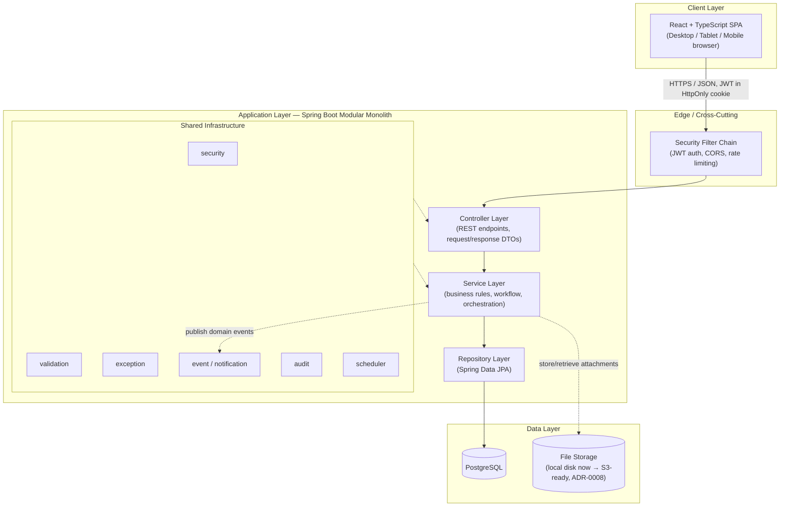
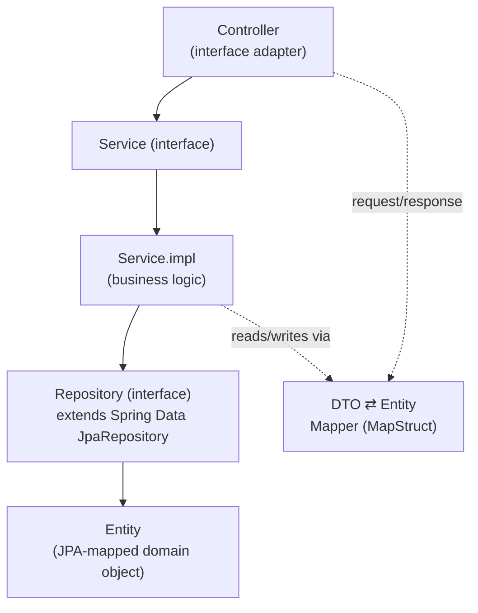
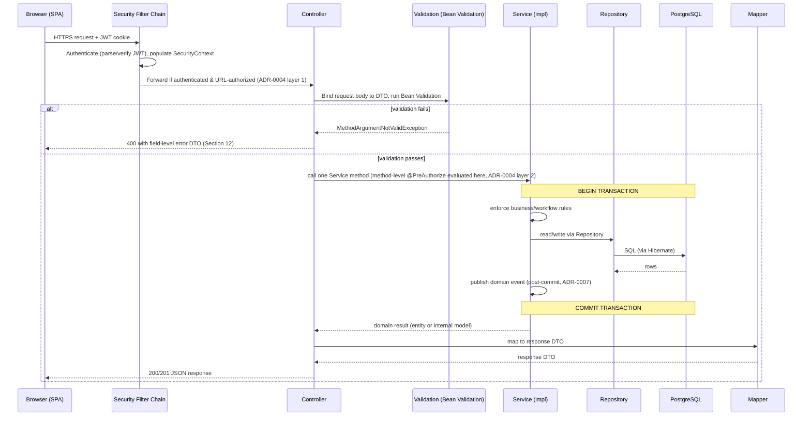
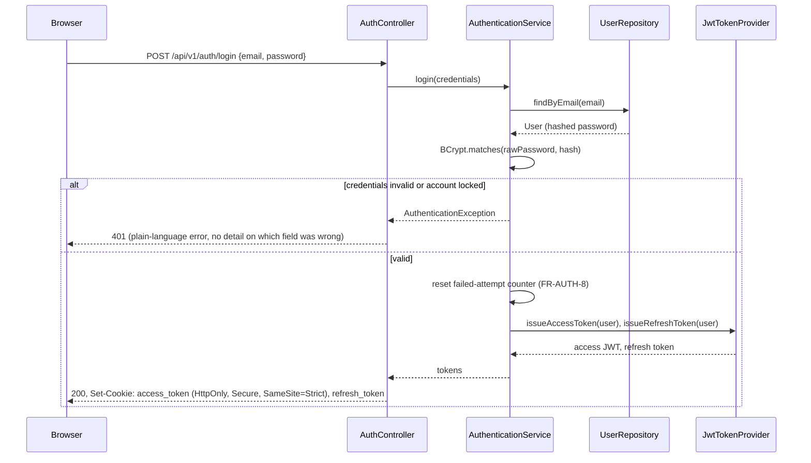
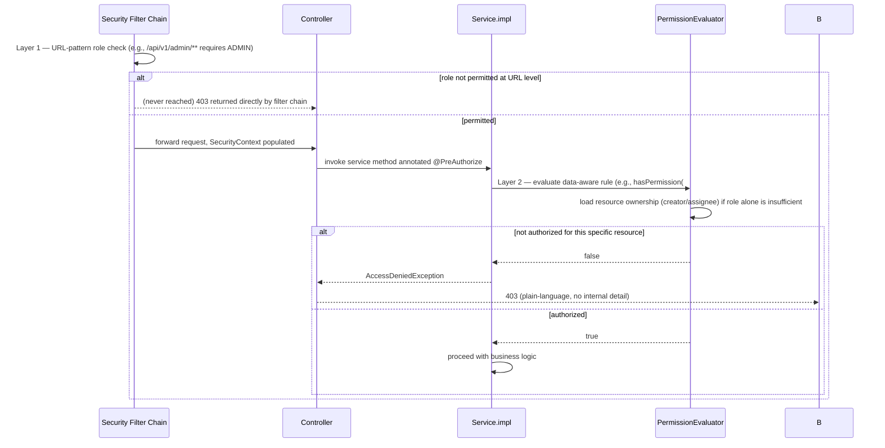
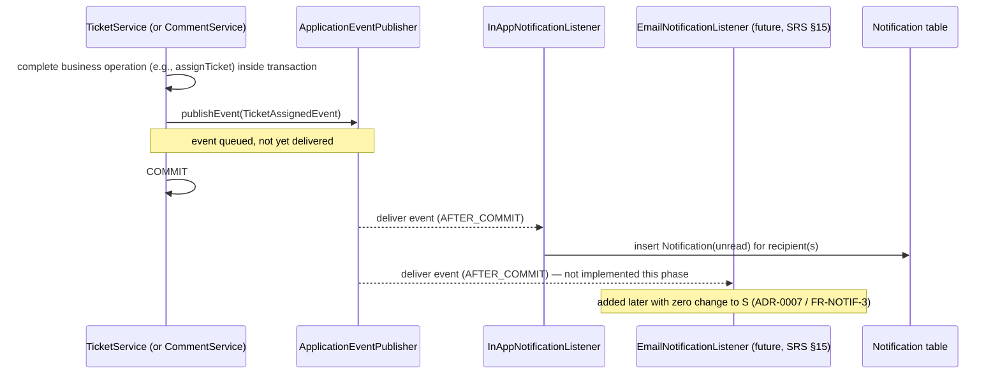
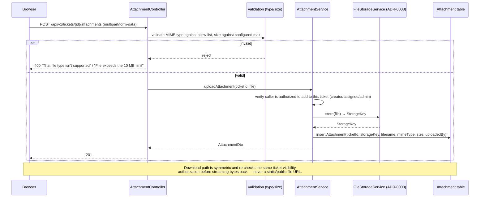
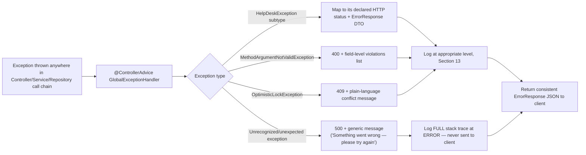

# 02 — Software Architecture Document (SAD)

## HelpDesk Management System

| | |
|---|---|
| **Document Version** | 1.0 |
| **Date** | 2026-07-19 |
| **Status** | Accepted — Architecture Phase |
| **Source of Truth for Scope** | [01-SRS.md](01-SRS.md) (unmodified — this document explains *how*, not *what*) |
| **Related Documents** | [03-Security.md](03-Security.md) · [04-API-Design.md](04-API-Design.md) · [05-Database.md](05-Database.md) · [06-Testing.md](06-Testing.md) · [ADR/](ADR/) |

---

## Table of Contents

1. Architectural Principles
2. High-Level Architecture
3. Low-Level Architecture (Layer Responsibilities)
4. Module Breakdown
5. Package Structure
6. Folder Structure
7. Request Lifecycle & Transaction Boundaries
8. Authentication Flow
9. Authorization Flow
10. Notification Flow
11. File Upload Flow
12. Exception Flow & Strategy
13. Logging Flow & Strategy
14. Validation Strategy
15. Mapping Strategy
16. Design Patterns Used
17. Configuration Strategy
18. Performance Considerations
19. Scalability Plan
20. Code Standards
21. Future Architecture Roadmap

Every decision with long-term or hard-to-reverse consequences is recorded as a numbered ADR in [ADR/](ADR/) and indexed in [Decisions.md](Decisions.md); this document explains how those decisions compose into a working system.

---

## 1. Architectural Principles

These are non-negotiable constraints applied to every module, not aspirations:

1. **Controllers never contain business logic.** A controller method's body is: deserialize (handled by Spring), validate (declarative), delegate to one service method, map the result to a response DTO, return. Nothing else.
2. **Repositories only talk to the database.** No business rule, no cross-module call, no HTTP concern belongs in a repository.
3. **Business rules live only in Services.** Ownership checks, workflow-transition rules, aggregation logic — all here.
4. **Validation is declarative, not scattered.** Structural validation (required fields, formats, lengths) lives in the `validation` layer via Bean Validation; business validation (uniqueness, state-transition legality) lives in the Service layer, explicitly, not hidden in a repository query.
5. **Security is cross-cutting, not per-feature.** Every module inherits its enforcement from the shared `security` package (filters + method security), never reimplements it (ADR-0004).
6. **Configuration is centralized and environment-driven**, never hardcoded (Section 17).
7. **Dependencies point inward.** `Controller → Service → Repository → Entity`. A module never reaches past a peer module's public `Service` interface into its `Repository` or `Entity` package (ADR-0001).
8. **Every architecturally significant decision is written down** as an ADR before being acted on, not decided implicitly in code review.

---

## 2. High-Level Architecture

The system is a **modular monolith** (ADR-0001) exposing a versioned REST API (ADR-0012), consumed by a decoupled React SPA (ADR-0002), backed by a single relational datastore (PostgreSQL).



**Key properties:**

- **Single deployable backend artifact** — one Spring Boot JAR, one process type to operate, matching the single-team scale in SRS Constraint C2.
- **Stateless application tier** — no server-side session; any request can be served by any backend instance behind a load balancer (ADR-0003), which is what makes horizontal scaling (SRS §8 Scalability) a matter of adding instances, not redesigning session handling.
- **Single source of truth database** — PostgreSQL holds all relational state; file bytes live behind the storage abstraction (ADR-0008), never in the database.
- **Explicit module boundaries inside the monolith** (Section 4) — the internal structure is already shaped like a set of services that happen to share a process and a database, so a future extraction (SRS §15, microservices) is additive, not a rewrite.

---

## 3. Low-Level Architecture (Layer Responsibilities)

Each module (Section 4) is internally structured in four layers, dependencies flowing strictly downward:



| Layer | Responsibility | Must Never |
|---|---|---|
| **Controller** | Bind HTTP request → validated DTO; call one Service method; map result → response DTO; set HTTP status. | Contain `if` statements expressing business rules; call a Repository directly; catch a business exception to "handle" it (that's the Global Exception Handler's job). |
| **Service (interface)** | Define the module's public contract — this is what other modules and the Controller depend on. | Leak entity types or repository types in its signature (DTOs and domain-level value objects only). |
| **Service.impl** | Enforce business rules, orchestrate repository calls, enforce ownership/authorization at the data level (ADR-0004), manage transaction boundaries (`@Transactional`), publish domain events (ADR-0007). | Contain HTTP-specific concerns (status codes, headers). |
| **Repository** | Persistence only — Spring Data JPA query derivation / `@Query` / Specifications. | Contain business rules (e.g., "is this transition legal" belongs in Service, not a repository query). |
| **Entity** | Map to a database table; encapsulate invariants that are always true regardless of caller (e.g., a `Ticket` cannot have a negative id). | Be serialized directly to/from JSON (ADR-0009); contain business workflow logic that depends on *other* entities' state. |
| **DTO** | Define the wire contract for one direction (request or response) of one endpoint. | Be reused as a JPA entity or persisted directly. |
| **Mapper** | Convert DTO ⇄ Entity, explicitly, at compile time (ADR-0009). | Contain business logic — a mapper is a pure structural transform. |

---

## 4. Module Breakdown

Modules are the unit of cohesion (ADR-0001, ADR-0011). Each is described by responsibility, dependencies, public interface, internal workflow, and extensibility.

### 4.1 Authentication
- **Responsibilities:** Registration, login, logout, email verification, password reset, password change, account lockout/throttling (FR-AUTH-1–8).
- **Depends on:** Users module (to create/read `User` records), `security` package (token issuance), `notification` (verification/reset emails-in-app-for-now, ADR-0007).
- **Public interface:** `AuthenticationService` (`register`, `login`, `refreshToken`, `logout`, `requestPasswordReset`, `resetPassword`, `changePassword`, `verifyEmail`).
- **Internal workflow:** See Section 8 (Authentication Flow).
- **Future extensibility:** OAuth2/Google login (SRS §15) adds a new `OAuth2AuthenticationService` implementation issuing the same JWT contract (ADR-0003) — no change to downstream modules that consume `Authentication` (they only ever see a validated principal).

### 4.2 Users
- **Responsibilities:** User profile CRUD, avatar upload, role assignment (Administrator-only), Support Engineer roster management (FR-PROF-1, part of Section 7.6 SRS).
- **Depends on:** `security` (password hashing), Attachments (avatar storage, via the same `FileStorageService`, ADR-0008).
- **Public interface:** `UserService` (`getProfile`, `updateProfile`, `changePassword`, `uploadAvatar`, `listUsers` [admin], `updateRole` [admin], `deactivateUser` [admin]).
- **Future extensibility:** Multi-organization/tenant fields (SRS §15 notes multi-tenancy is out of scope but not to be architecturally blocked) can be added as a nullable `organizationId` column later without breaking this module's contract.

### 4.3 Tickets
- **Responsibilities:** Ticket CRUD, status-workflow enforcement (FR-FLOW-1–3), assignment/reassignment, soft delete (ADR-0005), search/filter/sort/pagination (FR-TICK-9–11), CSV export.
- **Depends on:** Users (creator/assignee references), Categories (part of Administration module), Comments (composition), Attachments (composition), Audit (activity timeline, ADR-0006), Notification (event publishing, ADR-0007).
- **Public interface:** `TicketService` (`createTicket`, `getTicket`, `updateTicket`, `changeStatus`, `assignTicket`, `closeTicket`, `reopenTicket`, `searchTickets`, `exportTickets`, `softDeleteTicket` [admin]).
- **Internal workflow:** All status transitions pass through a single `TicketWorkflowValidator` (Strategy/State pattern, Section 16) that is the *only* place the legal-transition matrix (SRS §10) is encoded — never duplicated per calling method.
- **Future extensibility:** SLA timers/auto-escalation (SRS §17.1) plug in as a new `scheduler` job reading the same `Ticket`/`TicketActivity` data, no schema change required beyond an optional `sla_due_at` column.

### 4.4 Comments
- **Responsibilities:** Threaded comments per ticket, edit tracking (FR-COM-1–4).
- **Depends on:** Tickets (parent association), Attachments (composition), Notification (event publishing).
- **Public interface:** `CommentService` (`addComment`, `editComment`, `listComments`).
- **Future extensibility:** "Internal note" visibility (SRS §17.2) is a single additional `visibility` enum column (`PUBLIC`/`INTERNAL`) plus a repository-level filter keyed off the viewer's role — additive, not a redesign.

### 4.5 Attachments
- **Responsibilities:** File upload/retrieval scoped to a ticket or comment, type/size validation (FR-ATT-1–4).
- **Depends on:** `FileStorageService` abstraction (ADR-0008), Tickets/Comments (ownership scoping for authorization).
- **Public interface:** `AttachmentService` (`uploadAttachment`, `downloadAttachment`, `deleteAttachment`).
- **Future extensibility:** Virus/malware scanning hook (not in current SRS scope, but a natural production hardening) slots in as a pre-store step inside `AttachmentService` without touching the storage interface.

### 4.6 Notifications
- **Responsibilities:** In-app notification generation on the seven trigger events (FR-NOTIF-1), Notification Center read/unread state (FR-NOTIF-2).
- **Depends on:** Nothing upstream — it is a pure event *consumer* (ADR-0007), decoupled from every module that triggers a notification.
- **Public interface:** `NotificationService` (`listNotifications`, `markRead`, `markAllRead`) plus the internal `@EventListener` observers (not part of the public contract).
- **Future extensibility:** Email delivery (SRS §15) is a second listener on the same events (ADR-0007) — zero change to any other module.

### 4.7 Reports (Reporting & Analytics)
- **Responsibilities:** Aggregate reporting — tickets per category, resolution time, engineer performance, monthly/weekly stats (FR-REP-1–2).
- **Depends on:** Tickets, Users (read-only, aggregate queries — never mutates data it reads).
- **Public interface:** `ReportService` (`generateCategoryReport`, `generateResolutionTimeReport`, `generateEngineerPerformanceReport`, `exportReport`).
- **Internal workflow:** Reports run as read-only, projection-based queries directly against indexed columns (Section 19) rather than in-memory aggregation, so they stay responsive as ticket volume grows (SRS §8 Scalability).
- **Future extensibility:** If report queries become a measurable load concern at scale, this module's read path is the natural candidate for a read-replica or a materialized-view refresh job — isolated to this module because Reports never *writes* ticket data.

### 4.8 Dashboard
- **Responsibilities:** Role-specific landing aggregation (FR-DASH-1–4) — a composition layer, not a data owner.
- **Depends on:** Tickets, Notifications, Reports (read-only composition of each module's own service, never their repositories directly — ADR-0001).
- **Public interface:** `DashboardService` (`getUserDashboard`, `getEngineerDashboard`, `getAdminDashboard`).
- **Future extensibility:** Because Dashboard only composes other modules' public services, adding a new dashboard widget never requires touching Tickets/Reports internals.

### 4.9 Administration
- **Responsibilities:** Category management (FR-PRI-2–3), priority configuration, engineer roster/assignment policy, system-level configuration exposed to admins.
- **Depends on:** Users, Tickets (referential integrity on category deactivation).
- **Public interface:** `CategoryService` (`createCategory`, `renameCategory`, `deactivateCategory`, `listCategories`), `AdminConfigService`.

### 4.10 Audit
- **Responsibilities:** The append-only `TicketActivity` log (ADR-0006) and a separate **administrative audit log** (SRS §17.6) for user/role/category management actions — kept as two distinct logical streams because they have different audiences (ticket timeline is visible to ticket participants; admin audit log is Administrator/compliance-only).
- **Depends on:** Nothing — a pure write-behind sink called by every other module's Service layer within the same transaction (ADR-0006).
- **Public interface:** `TicketActivityRecorder` (`record(TicketActivityEvent)`), `AdminAuditRecorder` (`record(AdminAuditEvent)`) — deliberately narrow, append-only contracts (no `update`/`delete` methods exist, enforced by omission).

### 4.11 Configuration
- **Responsibilities:** Environment/profile-driven application configuration (Section 17) — not a runtime "module" with business logic, but a first-class architectural concern with its own package.
- **Public interface:** Strongly-typed `@ConfigurationProperties` classes (e.g., `FileUploadProperties`, `JwtProperties`, `MailProperties`), never raw `@Value` string lookups scattered through business code.

---

## 5. Package Structure

Per ADR-0011: top-level packages by module, layer sub-packages within each module, plus shared cross-cutting packages at the root. Root package: `com.helpdesk`.

```
com.helpdesk
│
├── auth/                      Module 4.1 — controller, service, service.impl, dto, mapper, validation
├── user/                      Module 4.2
├── ticket/                    Module 4.3 — includes ticket.workflow (State/Strategy transition validator)
├── comment/                   Module 4.4
├── attachment/                Module 4.5
├── notification/              Module 4.6
├── report/                    Module 4.7
├── dashboard/                 Module 4.8
├── admin/                     Module 4.9 (category, priority, roster)
├── audit/                     Module 4.10
│
├── config/                    Cross-cutting: @Configuration classes, @ConfigurationProperties (Section 17)
├── security/                  Cross-cutting: JWT provider/filter, RBAC (@PreAuthorize support, PermissionEvaluator), password encoder, CORS/CSRF config (ADR-0003, ADR-0004)
├── validation/                Cross-cutting: custom Bean Validation constraints shared across modules (module-specific validators live inside their own module package)
├── exception/                 Cross-cutting: custom exception hierarchy, GlobalExceptionHandler (@ControllerAdvice), error-response contract (Section 12)
├── event/                     Cross-cutting: domain event base types, ApplicationEventPublisher wiring (ADR-0007)
├── scheduler/                 Cross-cutting: @Scheduled jobs (e.g., waiting-for-user follow-up flag, FR-FLOW-3)
├── constants/                 Cross-cutting: enums and constants shared across modules (roles, permissions, status codes) — single source of truth referenced by both RBAC layers (ADR-0004)
├── util/                      Cross-cutting: small, pure, stateless helpers (e.g., ticket-number generator) — deliberately kept minimal; business logic never hides here
├── interceptor/                Cross-cutting: MVC interceptors (e.g., request-id correlation for logging, Section 13)
├── filter/                    Cross-cutting: Servlet filters (JWT auth filter, rate-limit filter) — distinct from `interceptor` because filters run pre-DispatcherServlet, interceptors run within it
├── listener/                  Cross-cutting: @EventListener classes that are not module-specific (e.g., audit-logging listener that observes events from every module)
└── documentation/             Cross-cutting: OpenAPI/Swagger configuration (springdoc bean setup), not endpoint definitions themselves
```

**Why this shape, package by package:**

- **`config`** exists so environment/profile wiring (Section 17) is never mixed with business `@Service` classes — a reviewer checking "how is the mail server configured" looks in exactly one place.
- **`security`** is intentionally a single shared package, not per-module, because RBAC/session/token logic must be centrally auditable — a scattered security implementation is a security bug waiting to happen (ADR-0004's whole premise depends on this).
- **`validation` vs `validation` inside each module:** shared, reusable constraints (e.g., a `@StrongPassword` annotation usable by both Auth and Users) live at the root; constraints meaningful only to one module's DTOs (e.g., a ticket-status-transition validator) live inside that module.
- **`exception`** is root-level because the Global Exception Handler (Section 12) must catch exceptions thrown by *any* module uniformly — this is the one place "one consistent error contract" is guaranteed.
- **`event`** holds only the plumbing (base `DomainEvent` class, publisher configuration); the actual event *types* (`TicketAssignedEvent`, etc.) live inside their owning module, keeping event definitions next to the business logic that raises them.
- **`interceptor` vs `filter`:** kept as two packages, not one, because they operate at different points in the request pipeline (Servlet filter chain vs. Spring `HandlerInterceptor`) and conflating them has caused real production bugs in other codebases (e.g., a filter assuming the security context is populated when only an interceptor guarantees that).
- **`listener`** (root) vs. module-owned `@EventListener` methods: a listener goes here only if it is *intentionally* cross-module (e.g., "log every domain event to the admin audit stream" listens to events from all modules); a listener that reacts to one module's event for that module's own purpose (e.g., Notification's `InAppNotificationListener`) stays inside that module.
- **`documentation`** is separated from `config` because OpenAPI grouping/tagging configuration changes far more often (as endpoints are added) than infrastructure config, and keeping it isolated avoids merge conflicts in a shared `config` file.

This is a deliberate improvement over a flat "one bucket per layer name" structure: it keeps the brief's suggested package list, but organizes it around module boundaries first (ADR-0011) so cohesion — an explicit primary objective — is structurally enforced, not just aspirational.

---

## 6. Folder Structure

Repository-level layout (already reflected in this repo's root):

```
HelpDesk-Management-System/
│
├── backend/
│   └── src/
│       ├── main/
│       │   ├── java/com/helpdesk/...      (Section 5 package tree)
│       │   └── resources/
│       │       ├── application.yml
│       │       ├── application-dev.yml
│       │       ├── application-prod.yml
│       │       ├── application-test.yml
│       │       └── db/migration/          (Flyway versioned migrations — see 05-Database.md)
│       └── test/
│           └── java/com/helpdesk/...      (mirrors main/, see 06-Testing.md)
│
├── frontend/
│   └── src/
│       ├── api/            Generated/typed REST client (from the OpenAPI contract, ADR-0002)
│       ├── features/       Feature-folder-per-module (mirrors backend module boundaries: tickets/, auth/, dashboard/, ...)
│       ├── components/     Shared, presentational UI components
│       ├── hooks/          Shared React hooks
│       ├── routes/         Route definitions, guarded by role (client-side mirror of Section 9 Authorization Flow — UX only, never the enforcement point)
│       └── store/          Client-side state management
│
└── docs/                   This document set
```

The frontend `features/` folders intentionally mirror the backend module list (Section 4) — a developer moving between the two codebases for "Tickets" finds the same name in both trees.

---

## 7. Request Lifecycle & Transaction Boundaries



**Transaction boundary rule:** `@Transactional` is declared at the **Service.impl** method level — never on Controllers (which must stay transaction-agnostic) and never on Repositories (a single repository call is not necessarily the full unit of work; e.g., "change ticket status" involves both the `Ticket` update and the `TicketActivity` insert, ADR-0006, which must commit or roll back together). Domain events are published with `AFTER_COMMIT` semantics (ADR-0007) so a notification is never generated for a change that ultimately rolled back.

**Response flow** is the mirror path: Service returns a domain result → Mapper (MapStruct, ADR-0009) converts to a response DTO → Controller returns it with the correct HTTP status → Jackson serializes to JSON → browser receives it. No entity object is ever on the wire (ADR-0009).

---

## 8. Authentication Flow



Full mechanics (token contents, expiry, rotation, lockout policy, password hashing algorithm) are specified in [03-Security.md](03-Security.md#authentication) — this section shows only the component interaction. See ADR-0003 for why stateless JWT was chosen over server-side sessions.

---

## 9. Authorization Flow



This two-layer enforcement is ADR-0004's core decision. The RBAC permission matrix itself (who can do what to which resource) is defined in [03-Security.md](03-Security.md#rbac-matrix), not duplicated here.

---

## 10. Notification Flow



Recipient resolution (who gets notified for which of the seven trigger events, FR-NOTIF-1) is a mapping owned by `InAppNotificationListener`, not by the publishing service — the publishing service only knows "a ticket was assigned," not "therefore notify the assignee and the creator." This keeps the publishing side fully decoupled from delivery/recipient policy (ADR-0007).

---

## 11. File Upload Flow



Validation happens in two places deliberately: MIME/size allow-list checking is structural validation (Section 14) that runs before any business logic; the "is this caller authorized to touch this ticket's attachments" check is business/ownership validation and belongs in the Service layer (Section 1, Principle 4).

---

## 12. Exception Flow & Strategy

### Exception hierarchy (`exception` package)

```
HelpDeskException (abstract base, carries an ErrorCode + HTTP status hint)
├── BusinessException            → 422/409 — a business rule was violated (e.g., illegal ticket-status transition)
├── ValidationException          → 400 — structural input was invalid (usually superseded by Bean Validation's own exception)
├── ResourceNotFoundException    → 404 — requested entity doesn't exist or isn't visible to this caller
├── AuthenticationException      → 401 — bad credentials, expired/invalid token
├── AccessDeniedException        → 403 — authenticated, but not authorized for this action/resource
└── ConflictException            → 409 — optimistic-lock conflict (ADR-0010), duplicate unique constraint
```

### Flow



### Error response contract (all error responses share this shape — see [04-API-Design.md](04-API-Design.md#error-response-format) for the full field list)

Every error response carries: a stable machine-readable `errorCode`, a plain-language `message` (SRS §8's explicit requirement — never a raw exception message), an optional field-level `violations` array for validation errors, a `timestamp`, and a `traceId` (correlates to server-side logs, Section 13) — but never a stack trace, SQL fragment, or internal class name (SRS Constraint C4, Acceptance Criterion 10).

A single `GlobalExceptionHandler` is the **only** place HTTP status codes are decided from exceptions — no controller has a local `try/catch` that formats its own error response, which is what keeps the error contract actually consistent across ~80 endpoints (Section "API Design" in [04-API-Design.md](04-API-Design.md)).

---

## 13. Logging Flow & Strategy

| Log category | Examples | Level | Sink |
|---|---|---|---|
| **Application logs** | Startup, configuration, scheduled-job execution | INFO / WARN | Console → aggregated (future: ELK/CloudWatch, roadmap Section 21) |
| **Authentication logs** | Login success/failure, lockout triggered, token refresh, logout | INFO (success), WARN (failure/lockout) | Dedicated logger (`com.helpdesk.security.audit`), never mixed with general app logs |
| **Audit logs** | Every `TicketActivity` write, every `AdminAuditRecorder` write (Section 4.10) | INFO, structured (JSON) | Database (source of truth) + log stream (operational visibility) |
| **Business logs** | Ticket created/assigned/resolved, notification dispatched | INFO | Console/aggregated |
| **Performance logs** | Requests exceeding a configured latency threshold, slow-query warnings | WARN | Console/aggregated, feeds Section 18 |
| **Error logs** | Unhandled exceptions (full stack trace), 5xx responses | ERROR | Console/aggregated, alerting-ready |

**Rules, enforced by convention and code review:**
- **Never log passwords, raw tokens, or full credit-card-equivalent secrets** — not even at DEBUG. Password fields are excluded from `toString()` on every entity/DTO that has one.
- **Never log full request/response bodies at INFO** for endpoints carrying personal data — only at DEBUG, and DEBUG is never enabled in the `prod` profile (Section 17).
- **Every log line includes a correlation `traceId`**, generated by a request-scoped `interceptor` (Section 5) at the start of each request and propagated through MDC (Mapped Diagnostic Context), so every log line for one request — across Controller, Service, and error handler — can be grepped together and matches the `traceId` returned in any error response (Section 12).
- **Structured (JSON) logging in `prod`/`test` profiles**, human-readable in `dev` (Section 17) — structured logs are what makes the future ELK/CloudWatch integration (Section 21) a configuration change, not a rewrite.

---

## 14. Validation Strategy

Four distinct validation layers, each with a distinct responsibility — never conflated:

| Layer | Mechanism | Example | Failure → |
|---|---|---|---|
| **DTO / Bean Validation** | `jakarta.validation` annotations (`@NotBlank`, `@Size`, `@Email`, `@Pattern`) on request DTO fields, triggered by `@Valid` in the controller | "email must be a valid email format"; "title must be 5–200 characters" | 400, field-level violations |
| **Custom structural validators** | Custom `@Constraint` annotations in `validation` package (root, shared) or module-local | `@StrongPassword` (SRS FR-AUTH-7 — length + character variety) | 400 |
| **Business validation** | Explicit checks in Service.impl, not annotations — because these require reading other data (DB state) | "email not already registered"; "ticket status transition is legal" (FR-FLOW-1); "category is active" | 409/422, `BusinessException` subtype |
| **Database constraints** | `UNIQUE`, `NOT NULL`, `CHECK`, foreign keys — the last line of defense, never the *first* (Section 5, [05-Database.md](05-Database.md)) | Unique index on `ticket_number`; FK from `ticket.category_id` to `category.id` | 409/500, translated by the Global Exception Handler into a plain-language `ConflictException`, never surfaced as a raw constraint-violation message |

**Why four layers and not one:** Bean Validation catches malformed input cheaply, before any database round-trip — good for both security (reject-early) and performance (Section 18). Business validation catches rules that are true only in the context of current data, which Bean Validation structurally cannot express. Database constraints exist because the database is the final consistency guarantee even if a future code path forgets to call the service-layer check — defense in depth, the same philosophy as ADR-0004's two-layer RBAC.

---

## 15. Mapping Strategy

Per ADR-0009: MapStruct generates all DTO ⇄ Entity conversion at compile time. Conventions:

- One `@Mapper(componentModel = "spring")` interface per entity, in that module's `mapper` package (e.g., `TicketMapper`).
- Request DTOs map **DTO → Entity** only for fields a client is allowed to set (e.g., `TicketCreateRequest` maps to `title`, `description`, `categoryId`, `priority` — never `status` or `assignedEngineerId`, which are Service-controlled).
- Response DTOs map **Entity → DTO** with explicit field lists — a new entity column is invisible in the API until a mapper is deliberately updated to expose it (secure-by-default, ADR-0009).
- Nested/associated entities (e.g., `Ticket.comments`) are mapped through their own dedicated DTO (`CommentSummaryDto`), never by serializing the JPA association directly — this is what prevents lazy-loading exceptions and N+1 surprises from leaking into the API layer (Section 18 covers the query-side fetch strategy).

---

## 16. Design Patterns Used

Patterns are applied only where they solve a concrete problem in this system — none are forced (per the brief's explicit instruction).

| Pattern | Where | Why |
|---|---|---|
| **Repository** | `repository` package, every module | Standard persistence abstraction; Spring Data JPA provides it natively — isolates Service layer from query mechanics (Section 3). |
| **DTO** | `dto` package, every module | Decouples wire contract from schema (ADR-0009). |
| **Strategy** | `TicketWorkflowValidator` (ticket status transitions, Section 4.3); `FileStorageService` (ADR-0008) | Both have a family of interchangeable algorithms/implementations behind one interface — status-transition rules could vary by category in the future (SRS §17.8), storage backend already varies by environment. |
| **Observer** | Notification event publishing (ADR-0007) | Decouples "a fact happened" from "who cares and what they do about it" — the textbook use case. |
| **Specification** | `TicketSpecification` (search/filter combinators, FR-TICK-9/FR-FILT-1) | Search supports arbitrary combinations of status/priority/category/engineer/date-range filters; Spring Data JPA `Specification<Ticket>` composes these as reusable, independently testable predicates instead of one combinatorial-explosion query method per filter combination. |
| **Builder** | Complex DTO/entity construction in tests, and for `ErrorResponse` construction in the exception handler | Improves readability where a constructor would otherwise take many optional parameters; not used where a simple constructor or MapStruct mapping already suffices — no Builder is added "for consistency" alone. |
| **Factory** | `JwtTokenProvider` (access vs. refresh token creation), `NotificationFactory` (event → `Notification` entity per event type, Section 10) | Centralizes object-creation logic that varies by an input discriminator (token type; event type), keeping that branching out of the Service layer. |
| **Adapter** | `FileStorageService` implementations (`LocalDiskStorageService`, future `S3StorageService`), `PasswordEncoder` (Spring Security's own abstraction over BCrypt) | Adapts an external/infrastructure API to the interface this application's Service layer expects — this is precisely what makes ADR-0008's swap possible. |
| **Template Method** | Abstract base for scheduled jobs in `scheduler` (e.g., a common "run, log start/end, handle failure" skeleton for the waiting-for-user follow-up job, FR-FLOW-3, and any future SLA job, SRS §17.1) | Shared job-lifecycle logic (logging, error handling, metrics) is written once; each concrete job overrides only the actual work step. |
| **Singleton** | Spring-managed beans (`@Service`, `@Repository`, `@Component`) | Handled by the Spring container itself — not manually implemented; called out here only so it's not mistaken for an omission. |
| **Dependency Injection** | Constructor injection everywhere (never field injection) | Makes every class's dependencies explicit and unit-testable without a Spring context (Section "Testing Architecture," [06-Testing.md](06-Testing.md)) — this is the mechanism that makes Principle 7 (Section 1) enforceable rather than aspirational. |

**Patterns deliberately *not* used:** Active Record (conflicts with strict Entity/Repository separation, Section 3); a generic/global Visitor or Chain-of-Responsibility for request processing (Spring's own filter/interceptor pipeline already covers this need — Section 5 — and adding a second processing pipeline would be redundant complexity).

---

## 17. Configuration Strategy

Spring profiles, one file per environment, all under `backend/src/main/resources/`:

| File | Purpose |
|---|---|
| `application.yml` | Profile-agnostic defaults: package-level logging pattern, common Jackson settings, common validation messages. Never contains a secret or an environment-specific hostname. |
| `application-dev.yml` | Local development: verbose (human-readable) logging, permissive CORS (localhost SPA), in-memory or local Postgres, local-disk file storage, mail disabled (or a local dev mail-trap). |
| `application-test.yml` | Used by the automated test suite ([06-Testing.md](06-Testing.md)): ephemeral/test-container database, deterministic clock where relevant, no external calls permitted (in-app-only notifications, local storage). |
| `application-prod.yml` | Structured JSON logging, strict CORS (SPA origin only), production datasource via environment variables (never a literal connection string in the file), S3 storage config (once ADR-0008's second implementation exists), mail provider config. |

**Secrets and environment variables:** No secret (DB password, JWT signing key, mail credentials) is ever committed in any `application-*.yml` — each is referenced via `${ENV_VAR_NAME}` placeholder syntax and supplied at deploy time through environment variables (local `.env`, not committed, for `dev`; the deployment platform's secret store for `prod`). This is what makes the later move to a secrets manager (AWS Secrets Manager / Vault, part of the AWS roadmap item, SRS §15) a supply-side change only — the application code never changes how it reads a property.

**Strongly-typed configuration:** Every cohesive configuration group is bound to a `@ConfigurationProperties` class (e.g., `JwtProperties{accessTokenTtl, refreshTokenTtl, issuer}`, `FileUploadProperties{maxFileSizeBytes, allowedMimeTypes, maxAttachmentsPerTicket}`, `MailProperties`) rather than scattered `@Value("${...}")` injections — this gives compile-time-checked, IDE-discoverable configuration and a single place to see everything one concern depends on.

**Mail:** Configured but inert in this phase (Assumption A7) — a `MailProperties` class and a `NoOpMailSender`/disabled auto-configuration exist so enabling real SMTP later (SRS §15) is a profile + dependency change, not new code (ADR-0007 is what makes the *triggering* logic already ready; this is what makes the *transport* config already shaped correctly).

**Logging config:** Centralized in `logback-spring.xml`, profile-aware (human-readable console appender for `dev`, JSON appender for `test`/`prod`) — consistent with Section 13.

**File upload config:** `FileUploadProperties` (max size, allowed MIME types, max attachments) is the single source both the Bean Validation layer (Section 14) and the multipart servlet configuration (`spring.servlet.multipart.max-file-size`) read from, so the two never drift out of sync.

---

## 18. Performance Considerations

| Concern | Approach |
|---|---|
| **Pagination** | Every list endpoint (tickets, notifications, users, reports) is paginated by default (Spring Data `Pageable`); SRS §7.10/FR-PAGE-1 makes this mandatory, not optional — there is no "return all rows" endpoint for any potentially large collection. |
| **N+1 prevention** | Fetch strategy is explicit per query: list views use projection DTOs / `@EntityGraph` or `JOIN FETCH` for the specific associations the view needs (e.g., ticket list needs `category` and `assignedEngineer` names but not the full `comments` collection) — never the JPA default of lazy-loading triggered per-row inside a loop. Association fields default to `FetchType.LAZY` everywhere (Section "Fetch Strategies," [05-Database.md](05-Database.md)); eager fetching is an explicit, per-query decision, never the entity default. |
| **Indexing** | Every column used in a search/filter/sort predicate (FR-SRCH-1, FR-FILT-1, FR-SORT-1) is indexed — full detail in [05-Database.md](05-Database.md#indexing-strategy). |
| **Caching** | Not required at current scale (SRS §8's "tens of thousands of tickets," not millions), but the Service layer already calls through `@Cacheable`-eligible methods (e.g., `CategoryService.listActiveCategories`, rarely-changing reference data) so adding Spring's Redis-backed cache abstraction (SRS §15) later is a dependency + annotation-target change, not a redesign. |
| **Connection pooling** | HikariCP (Spring Boot's default), sized via `application-prod.yml`, monitored via Actuator metrics (Section 21). |
| **Batch processing** | Bulk operations (SRS §17.7, future bulk-assign/close) are designed to use JDBC batching (`hibernate.jdbc.batch_size`) rather than N individual `save()` calls, from the point they're introduced. |
| **Report query cost** | Report aggregation (Section 4.7) runs as SQL-level `GROUP BY`/aggregate queries against indexed columns, not application-level iteration over fetched entities — keeps reporting responsive independent of ticket volume growth. |
| **Lazy loading discipline** | Because entities never cross the Controller boundary (ADR-0009) and every Service method is `@Transactional`, lazy associations are always resolved *inside* the transaction, before mapping to DTO — eliminating `LazyInitializationException` as a class of bug entirely, rather than working around it per-endpoint. |

---

## 19. Scalability Plan

The architecture is deliberately shaped so each future-scope item in SRS §15 requires *addition*, not *rework*:

| Future integration | Why this architecture already accommodates it |
|---|---|
| **Redis** (caching / session) | Stateless auth (ADR-0003) means Redis is optional infrastructure for performance, not a session-correctness dependency; Spring's cache abstraction (Section 18) drops in with a starter + config. |
| **Kafka / RabbitMQ** | The Observer-pattern notification abstraction (ADR-0007) already decouples event producers from consumers through a well-defined event object — swapping the in-process `ApplicationEventPublisher` for a broker-backed publisher changes the `event` package's transport binding only. |
| **Docker / Kubernetes** | Single deployable JAR + externalized config via environment variables (Section 17) is already container-shaped; no code changes needed, only a `Dockerfile`/Helm chart addition (roadmap, Section 21). |
| **JWT (stateless auth)** | Already the chosen mechanism from day one (ADR-0003), not deferred. |
| **OAuth2 / Google login** | New `AuthenticationService` implementation issuing the same JWT contract (Section 4.1) — downstream modules are unaffected because they only ever see a validated `Principal`. |
| **AWS deployment** | `FileStorageService` (ADR-0008) is provider-agnostic already; RDS-hosted PostgreSQL requires only a connection-string/credential change (Section 17); Actuator health endpoints (Section 21) are ALB/ELB-health-check-ready out of the box. |
| **Microservices decomposition** | Module boundaries (Section 4) are already service-shaped — each module's public `Service` interface is a candidate REST/gRPC contract, and no module reaches into another's repository (ADR-0001), so extraction doesn't require untangling hidden coupling first. |
| **REST API for third parties / mobile** | Already the primary interface (ADR-0002); versioning (ADR-0012) means a mobile client can pin to `v1` while the SPA moves to `v2` independently. |
| **GraphQL** (if ever added) | Would sit as an additional interface-layer adapter calling the same Service layer — Services never assume a REST/HTTP-shaped caller. |

Horizontal scaling of the application tier itself requires no session affinity (ADR-0003) — any number of stateless backend instances can sit behind a load balancer from day one.

---

## 20. Code Standards

| Concern | Standard |
|---|---|
| **Naming** | Classes: `PascalCase`, suffixed by role (`TicketService`, `TicketServiceImpl`, `TicketController`, `TicketRepository`, `TicketDto`, `TicketMapper`, `TicketNotFoundException`). Packages: all-lowercase, singular module names (`ticket`, not `tickets`). Constants: `UPPER_SNAKE_CASE` in the `constants` package, never magic literals inline. |
| **Dependency Injection** | Constructor injection only (Section 16) — enables `final` fields, fails fast on missing beans, and is trivially testable without a Spring context. |
| **Method size** | A method does one thing at one level of abstraction; a Service method orchestrating more than ~5–7 sequential steps is a signal to extract a private helper or a collaborating class — enforced in code review, not tooling alone. |
| **Class responsibility** | One class, one reason to change (SRP) — a `TicketServiceImpl` that also formats CSV export output is a signal the export concern belongs in its own `TicketExportService`. |
| **Transactions** | `@Transactional` at Service.impl method boundaries only (Section 7); read-only queries are annotated `@Transactional(readOnly = true)` so Hibernate can skip dirty-checking overhead. |
| **Comments** | Code should read clearly enough that comments explaining *what* are unnecessary; a comment is justified only for non-obvious *why* (e.g., "ordering matters here because X"). No commented-out code is ever committed. |
| **Documentation** | Public Service interfaces carry Javadoc describing the contract (preconditions, exceptions thrown) — this is the API a module presents to the rest of the system, and deserves the same documentation rigor as an external API. Internal `impl` classes are documented only where behavior is non-obvious. |
| **Version control** | Conventional commit messages (`feat:`, `fix:`, `refactor:`, `docs:`); one logical change per commit; feature branches off `main`, merged via reviewed pull request — no direct commits to `main`. |
| **Immutability** | DTOs are immutable (Java `record` types) wherever the framework allows — request DTOs in particular, since they represent a fact ("what the client sent") that should never be mutated after binding. |

---

## 21. Future Architecture Roadmap

Ordered roughly by expected adoption sequence, each item cross-referenced to the ADR or section that already prepares for it:

1. **Containerization (Docker)** — package the existing single JAR; no application code change (Section 19).
2. **CI/CD pipeline** — build, run the test pyramid ([06-Testing.md](06-Testing.md)), publish container image, deploy.
3. **Observability stack** — Spring Boot Actuator health/metrics endpoints + structured JSON logs (Section 13) feed a future Prometheus/Grafana or CloudWatch stack; the `traceId` correlation (Section 13) is already in place for distributed tracing (e.g., OpenTelemetry) to build on.
4. **Redis** — caching layer (Section 18) and, if server-side session state is ever reintroduced for a specific reason, a shared session store — not required for current stateless auth (ADR-0003).
5. **Email delivery** — second `NotificationListener` implementation (ADR-0007); zero change to triggering logic.
6. **OAuth2 / Google login** — additional `AuthenticationService` implementation (Section 4.1).
7. **Cloud object storage (S3)** — second `FileStorageService` implementation (ADR-0008).
8. **AWS deployment (RDS + ECS/EKS)** — externalized config (Section 17) and container packaging (item 1) are the prerequisites; both already satisfied.
9. **Asynchronous messaging (Kafka/RabbitMQ)** — transport upgrade behind the existing event abstraction (ADR-0007); candidate first use is durable email/notification dispatch and report-generation offloading.
10. **Data retention / archival job** — a `scheduler` job (Section 5) formalizing SRS §17.10, operating on the soft-delete flag already in place (ADR-0005).
11. **SLA management & auto-escalation** (SRS §17.1) — new `scheduler` job + optional `sla_due_at` column on `Ticket`; the workflow-validator Strategy (Section 16) already isolates transition-rule changes to one place.
12. **Microservices decomposition** — only pursued if genuine scale/team-topology reasons emerge (ADR-0001 explicitly frames this as a later option, not a default trajectory); module boundaries (Section 4) are the pre-drawn seams.
13. **GraphQL interface** — additive adapter beside REST (Section 19), only if a concrete client need (e.g., a mobile client with strict bandwidth constraints) justifies it.

Each of these is deliberately *additive* against the architecture defined above — none require revisiting the module boundaries (Section 4), the layering rules (Section 3), or the core ADRs (0001–0012).
