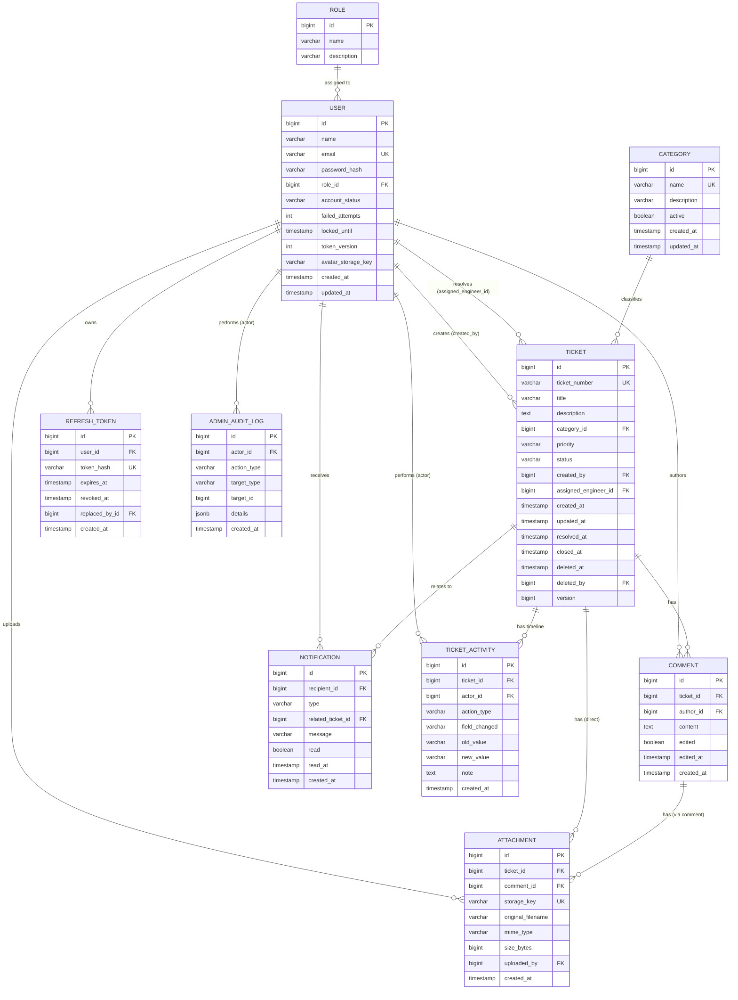

# 05 — Database Design

## HelpDesk Management System

| | |
|---|---|
| **Document Version** | 1.0 |
| **Status** | Accepted — Architecture Phase |
| **Engine** | PostgreSQL (ADR-0002) |
| **Related** | ADR-0005 (soft delete), ADR-0006 (append-only activity log), ADR-0010 (optimistic locking) |

This document specifies the **conceptual and logical data model** — entities, relationships, keys, indexing, and integrity rules. No DDL/SQL is included; attribute lists are illustrative of what each entity holds, not a column-by-column physical schema (that is an implementation artifact generated from the JPA entities described in [02-Architecture.md §3](02-Architecture.md#3-low-level-architecture-layer-responsibilities), version-controlled as Flyway migrations under `backend/src/main/resources/db/migration/`).

---

## 1. Entity Inventory

| Entity | Purpose | Mutable? |
|---|---|---|
| **User** | Every registered principal (User, Support Engineer, Administrator) | Yes |
| **Role** | Reference table for the three fixed roles | Reference (seed) data |
| **RefreshToken** | Server-side record of issued refresh tokens (ADR-0003) | Append/revoke |
| **Category** | Configurable ticket taxonomy (FR-PRI-2/3) | Yes (deactivate, never delete) |
| **Ticket** | Core support-request record | Yes |
| **TicketActivity** | Immutable timeline of every ticket state change (ADR-0006) | Append-only |
| **Comment** | Threaded discussion on a ticket | Yes (edit-tracked) |
| **Attachment** | File metadata scoped to a ticket or comment | Yes (delete by uploader/admin) |
| **Notification** | In-app notification instance | Yes (read/unread) |
| **AdminAuditLog** | Administrative action log (SRS §17.6) | Append-only |

**Priority and Status are not separate tables.** They are modeled as fixed, application-level enumerations (`Priority{LOW,MEDIUM,HIGH,URGENT}`, `TicketStatus{OPEN,ASSIGNED,IN_PROGRESS,WAITING_FOR_USER,RESOLVED,CLOSED,REOPENED}`) persisted as a constrained column (native PostgreSQL `ENUM` type or `VARCHAR` + `CHECK` constraint), not a foreign key to a lookup table. This is a deliberate asymmetry with `Category`, justified below (Section 8).

**Assignment History is not a separate table.** It is a filtered *view* over `TicketActivity` where `action_type = 'ASSIGNMENT'`, not a duplicate log. Maintaining two independent history tables for overlapping facts (assignment is itself a kind of activity) would risk them diverging and contradicts ADR-0006's single-audit-stream decision. `GET /tickets/{id}/activity` (see [04-API-Design.md](04-API-Design.md)) supports filtering by `actionType` client-side to render an "assignment history" view from the same data.

---

## 2. Entity-Relationship Diagram

---

## 3. Relationship Justification (Cardinality Explained)

| Relationship | Cardinality | Why |
|---|---|---|
| Role → User | 1 : N | Each user has exactly one role in this phase (three fixed roles, Assumption A1) — a many-to-one FK, not many-to-many, since the SRS never requires a user to hold multiple simultaneous roles. Kept as a reference *table* rather than a hardcoded enum specifically so a future role/permission expansion (e.g., a fourth role, or per-role permission overrides) is a data change, not a schema migration touching every FK. |
| User (creator) → Ticket | 1 : N | One user creates many tickets over time; a ticket has exactly one creator (FR-TICK-2) — never nullable. |
| User (engineer) → Ticket | 1 : N, nullable | A ticket has at most one assigned engineer at a time (Assumption A2: no multi-engineer co-assignment); nullable because a ticket starts `OPEN` with no assignee. One engineer is assigned to many tickets concurrently (their workload, FR-DASH-3). |
| Category → Ticket | 1 : N | A ticket has exactly one category (FR-TICK-2); a category classifies many tickets. FK uses `ON DELETE RESTRICT` — categories are never hard-deleted (FR-PRI-3), only deactivated, so this constraint is a defensive safety net, not an expected code path. |
| Ticket → TicketActivity | 1 : N | Every state-changing action produces exactly one activity row; a ticket accumulates an unbounded, append-only timeline (FR-TICK-12, ADR-0006). |
| User (actor) → TicketActivity | 1 : N | Every activity row is attributed to exactly one actor (FR-TICK-12's "with actor and timestamp" requirement) — never nullable, since even a system-triggered transition (e.g., a future SLA auto-escalation) is attributed to a designated system actor account, preserving "every entry has an actor" as an invariant. |
| Ticket → Comment | 1 : N | A ticket has a threaded list of comments (FR-COM-1); a comment belongs to exactly one ticket. |
| User (author) → Comment | 1 : N | A comment has exactly one author (FR-COM-3). |
| Ticket → Attachment (direct) **XOR** Comment → Attachment | 1 : N each, mutually exclusive | FR-ATT-4: "every attachment shall be associated with exactly one ticket (and, where applicable, one comment)." Modeled as two nullable FKs (`ticket_id`, `comment_id`) with a `CHECK` constraint enforcing exactly one is non-null — a ticket-level attachment has `ticket_id` set and `comment_id` null; a comment-level attachment has both set (`comment_id` set, `ticket_id` denormalized-set to the parent ticket to keep "which ticket does this attachment belong to" a single-hop query for the authorization check in [03-Security.md §12](03-Security.md#12-file-upload-security), rather than a join through `Comment`). |
| User (uploader) → Attachment | 1 : N | Every attachment records who uploaded it. |
| User (recipient) → Notification | 1 : N | A notification always targets exactly one recipient (FR-NOTIF-1/2) — no broadcast/multi-recipient notification row; a single triggering event that notifies multiple people (e.g., ticket assigned notifies both the engineer and the creator) produces multiple `Notification` rows, one per recipient, keeping read/unread state independently trackable per person. |
| Ticket → Notification | 1 : N, nullable | Most notifications relate to a specific ticket (nullable to allow a future non-ticket-scoped notification, e.g., an account-level message, without a schema change). |
| User → RefreshToken | 1 : N | A user may hold multiple concurrent refresh tokens (multiple devices/browsers) — each login issues its own; rotation (ADR-0003) replaces one token with another via `replaced_by_id`, forming an auditable chain used for reuse-detection. |
| User (actor) → AdminAuditLog | 1 : N | Every administrative action is attributed to exactly one Administrator (SRS §17.6). `target_type`/`target_id` is a lightweight polymorphic reference (User, Category, etc.) rather than a separate FK per possible target type — appropriate here because this log is written-once/read-rarely and never joined against for business logic, only displayed (Section 11 of [04-API-Design.md](04-API-Design.md)). |

---

## 4. Keys & Constraints

- **Primary keys:** surrogate `BIGINT` identity/sequence on every table — never a natural key (email, ticket number) as PK, so that a future need to change a "natural" value (e.g., email address) never cascades into a primary-key rewrite across every referencing table.
- **Unique constraints:**
  - `user.email` — one account per email (FR-AUTH-1).
  - `ticket.ticket_number` — human-readable, globally unique, immutable once generated (FR-TICK-1); generated by application logic (`util` package, [02-Architecture.md §5](02-Architecture.md#5-package-structure)) as `HD-{year}-{sequential}`, backed by this unique constraint as the integrity guarantee of last resort.
  - `category.name` — no duplicate category names (case-insensitive, enforced via a functional unique index).
  - `refresh_token.token_hash` — a stolen/replayed hash cannot collide with a live token undetected.
  - `attachment.storage_key` — one-to-one with the physical object the storage abstraction manages (ADR-0008).
- **Foreign keys:** every FK listed in Section 3 is enforced at the database level (not application-trust-only) — the database is the last line of defense per the four-layer validation strategy ([02-Architecture.md §14](02-Architecture.md#14-validation-strategy)).
- **`CHECK` constraints:** `priority`/`status`/`account_status`/`action_type` columns constrained to their fixed value sets; the `Attachment` ticket-XOR-comment rule (Section 3); `ticket.resolved_at IS NULL OR ticket.resolved_at >= ticket.created_at` (temporal sanity).
- **`NOT NULL`:** applied to every field the SRS treats as mandatory at creation (e.g., `ticket.title`, `ticket.created_by`) — nullability is an explicit, reviewed decision per column, not a default.

---

## 5. Cascade Rules

| Relationship | On parent delete | Rationale |
|---|---|---|
| Category → Ticket | `RESTRICT` | Categories are never hard-deleted by the application (FR-PRI-3); this constraint makes an accidental hard-delete attempt fail loudly rather than silently orphaning historical tickets. |
| User → Ticket (creator/assignee) | `RESTRICT` | Users are never hard-deleted either (deactivated only, mirroring ADR-0005's philosophy) — same defensive rationale. |
| Ticket → Comment / Attachment / TicketActivity | `RESTRICT` | A ticket is soft-deleted (ADR-0005), never hard-deleted, so its children are never expected to lose their parent; `RESTRICT` guards against a future code path mistakenly issuing a hard delete. |
| User → RefreshToken | `CASCADE` | Tokens are pure session artifacts with no independent audit value once their owning user record is gone (relevant only to a future retention/purge job, [02-Architecture.md §21](02-Architecture.md#21-future-architecture-roadmap) item 10 — not a current code path since users aren't deleted today). |
| User → Notification | `CASCADE` | Same reasoning — notifications have no standalone value without their recipient. |
| Comment → Attachment | `RESTRICT` | Comments are never deleted (only edit-tracked, FR-COM-3), so this is a defensive constraint, consistent with the rest of this table. |

The consistent pattern — `RESTRICT` on anything the application intentionally never hard-deletes, `CASCADE` only on purely dependent artifacts with no independent audit value — makes the database schema itself assert the soft-delete/audit-integrity philosophy (ADR-0005, SRS §8 Auditability), not just application code discipline.

---

## 6. Indexing Strategy

Every column that appears in a `WHERE`, `ORDER BY`, or `JOIN` for a list/search/filter/sort/report endpoint ([04-API-Design.md](04-API-Design.md)) is indexed:

| Table.Column(s) | Index type | Serves |
|---|---|---|
| `ticket.ticket_number` | B-tree, unique | Direct lookup by ticket number (FR-SRCH-1) |
| `ticket.status`, `ticket.priority`, `ticket.category_id`, `ticket.assigned_engineer_id`, `ticket.created_by` | B-tree, individual | Single-field filters (FR-FILT-1) |
| `ticket.(status, priority)` | B-tree, composite | Common combined filter (dashboard "open + urgent" views, FR-DASH-3) |
| `ticket.(assigned_engineer_id, status)` | B-tree, composite | Engineer's queue sorted/filtered by status (FR-DASH-3, UC-3) |
| `ticket.created_at`, `ticket.updated_at` | B-tree | Sort (FR-SORT-1) and report date-range filtering (FR-REP-1) |
| `ticket.deleted_at` | B-tree, partial (`WHERE deleted_at IS NULL`) | Makes the default "exclude soft-deleted" filter (ADR-0005) cheap regardless of table growth |
| `ticket.(title, description)` | GIN, `tsvector` full-text | Free-text search (FR-SRCH-1) — PostgreSQL native full-text search chosen over a bolt-on search engine (e.g., Elasticsearch) as unjustified infrastructure at current scale (SRS §8: tens of thousands of tickets, not a scale that demands a dedicated search cluster); revisit only if search latency/relevance becomes a measured problem. |
| `ticket_activity.ticket_id`, `.(ticket_id, created_at)` | B-tree | Timeline retrieval, chronologically ordered (FR-TICK-12) |
| `comment.ticket_id` | B-tree | Thread retrieval (FR-COM-1) |
| `attachment.ticket_id`, `attachment.comment_id` | B-tree | Attachment listing per parent |
| `notification.(recipient_id, read)` | B-tree, composite | Unread-count / unread-filtered list (FR-NOTIF-2) — the single most frequent notification query, so it gets a dedicated composite index rather than relying on `recipient_id` alone. |
| `user.email` | B-tree, unique | Login lookup (FR-AUTH-3) — the hottest query in the system, always indexed. |
| `refresh_token.token_hash` | B-tree, unique | Refresh-token verification on every `/auth/refresh` call. |
| `category.name` | B-tree, unique (functional, lower-case) | Case-insensitive uniqueness (Section 4) and picker lookups. |

**Index review discipline:** every new list/filter/sort endpoint added post-launch is a checklist item — "does its query path touch an unindexed column" — treated as a required review question, not an afterthought performance pass (ties to [02-Architecture.md §18](02-Architecture.md#18-performance-considerations)).

---

## 7. Fetch Strategies

All `@ManyToOne`/`@OneToMany` associations default to `FetchType.LAZY` (stated in [02-Architecture.md §18](02-Architecture.md#18-performance-considerations); restated here as the data-model rule it fundamentally is). Concretely:

- `Ticket.category`, `Ticket.createdBy`, `Ticket.assignedEngineer` — lazy `@ManyToOne`, resolved via `JOIN FETCH`/`@EntityGraph` on the specific query that needs the associated name/email (e.g., ticket list view fetches `category.name` and `assignedEngineer.name` in one query, not N+1).
- `Ticket.comments`, `Ticket.attachments`, `Ticket.activity` — lazy `@OneToMany`, **never** fetched as part of `GET /tickets/{id}`; each has its own paginated endpoint ([04-API-Design.md §5/§6/§4](04-API-Design.md)) because an unbounded collection embedded in a ticket-detail response would violate the mandatory-pagination rule (FR-PAGE-1) by the back door.
- Report queries (Section 4.7 of [02-Architecture.md](02-Architecture.md#47-reports-reporting--analytics)) bypass entity fetching entirely where possible, using projection queries (`SELECT new ...Dto(...)` JPQL or native aggregate SQL) directly against indexed columns — no entity hydration overhead for data that's immediately reduced to a count/average.

---

## 8. Normalization & the Priority/Status Design Choice

The schema is in **3NF**: no repeating groups, every non-key attribute depends on the whole key and nothing but the key (e.g., `ticket_number` is derived/generated but stored, justified as a controlled denormalization for the FR-TICK-1 human-readable-identifier requirement — regenerating it from `id` on every read would be more "pure" but adds no integrity benefit and complicates a stable public-facing identifier).

**Why `Category` is a table but `Priority`/`Status` are enums, not tables**, despite superficially looking similar:

- `Category` has an explicit admin CRUD requirement (FR-PRI-3: add, rename, deactivate) — it is *data*, administered at runtime, and must be a table to be mutable without a deployment.
- `Priority` (FR-PRI-1) and `Status` (SRS §10) are **fixed by the specification itself** — four priorities, seven statuses, with status transitions governed by hardcoded workflow rules (FR-FLOW-1, enforced by the `TicketWorkflowValidator` Strategy, [02-Architecture.md §16](02-Architecture.md#16-design-patterns-used)) that reference specific status *values* in code (e.g., "cannot go directly from OPEN to CLOSED"). Making these a mutable lookup table would let someone add a status value the workflow validator doesn't know how to handle — a data change that silently breaks business logic. Keeping them as application-level enums makes the compiler/type-system enforce that every status value used anywhere has a known, reviewed meaning.
- If a future requirement genuinely needs admin-configurable priorities (SRS §17.8, "configurable SLA/priority matrix per category," names exactly this direction), that is a deliberate future migration from enum to lookup table — noted here as an explicit non-decision-yet, not an oversight.

---

## 9. Optimistic Locking

`Ticket.version` (`@Version`, JPA/Hibernate-managed `BIGINT`) is the only entity carrying optimistic locking (ADR-0010) — it is the one entity in the model with a realistic concurrent-write pattern (simultaneous status change + reassignment + priority re-triage, Section 4.3 of [02-Architecture.md](02-Architecture.md#43-tickets)). Every other entity in this model is either append-only (`TicketActivity`, `AdminAuditLog` — no update path exists, so no conflict is possible) or has a narrow, single-owner write path (a `Comment` is only ever edited by its author; a `Notification`'s only mutation is its own owner flipping `read`) where concurrent-conflict risk is negligible and `@Version` would be unjustified overhead.

---

## 10. Soft Delete Model

Per ADR-0005: `ticket.deleted_at` (nullable `TIMESTAMP`) + `ticket.deleted_by` (FK to `User`). Every repository query for tickets applies a default `deleted_at IS NULL` predicate (Section 6's partial index makes this cheap); an explicit, Administrator-only "include deleted" query path exists solely for audit/compliance review, never for normal ticket list/search/dashboard views. `Category.active` (`BOOLEAN`, default `true`) plays the equivalent role for categories (Section 8) — deactivated, not deleted, and always still joinable from historical tickets.

---

## 11. Timestamp Auditing & Versioning

Every mutable entity carries `created_at`/`updated_at`, populated automatically via Hibernate's `@CreatedDate`/`@LastModifiedDate` (JPA Auditing), never set manually by service code — eliminates an entire class of bug where a developer forgets to stamp a timestamp on one code path. Append-only entities (`TicketActivity`, `AdminAuditLog`) carry `created_at` only — there is no `updated_at` because, by design (ADR-0006), no update ever occurs; the *absence* of that column is itself a structural guarantee reinforcing the append-only contract, not an oversight.

`Ticket.version` (Section 9) is the schema's only optimistic-concurrency version column; it is unrelated to, and not to be confused with, schema/migration versioning, which is handled at the tooling level by Flyway's own migration-history table (`flyway_schema_history`), external to the application's domain schema.
