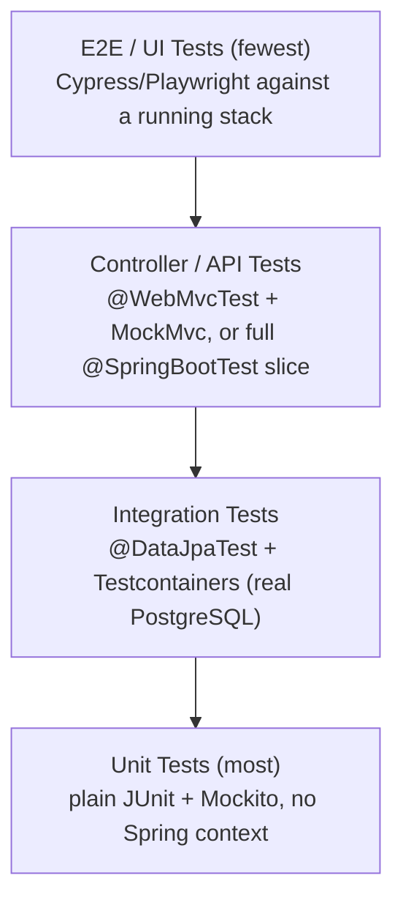

# 06 — Testing Architecture

## HelpDesk Management System

| | |
|---|---|
| **Document Version** | 1.0 |
| **Status** | Accepted — Architecture Phase |
| **Traces to** | [01-SRS.md §16](01-SRS.md#16-acceptance-criteria) (Acceptance Criteria — the test suite is the mechanism that proves each is met) |
| **Related** | [02-Architecture.md §16](02-Architecture.md#16-design-patterns-used) (constructor DI makes unit testing possible without a Spring context) |

---

## 1. Testing Pyramid



The pyramid shape is deliberate: unit tests are cheapest to write and run (milliseconds, no context), so business logic (Service layer) is exhaustively covered there; each layer up trades speed for realism, and is used only for what the layer below it structurally cannot verify.

---

## 2. Unit Tests

- **Target:** Service.impl classes, mappers, validators, utility classes (`util`, `constants`-adjacent logic) — anything expressible as pure input→output behavior.
- **Mechanism:** Plain JUnit 5 + Mockito, dependencies mocked via constructor injection (no `@SpringBootTest`, no application context startup) — this is precisely why [02-Architecture.md §16](02-Architecture.md#16-design-patterns-used) mandates constructor injection over field injection: a `TicketServiceImpl` can be instantiated directly with mocked `TicketRepository`/`TicketActivityRecorder`/`ApplicationEventPublisher` in a test method with no framework involved.
- **Coverage focus:** the `TicketWorkflowValidator` Strategy ([02-Architecture.md §16](02-Architecture.md#16-design-patterns-used)) gets exhaustive transition-matrix coverage — every legal transition in SRS §10 asserted to succeed, every illegal one (e.g., `OPEN → CLOSED` directly) asserted to throw — because this is the single place FR-FLOW-1 lives, and Acceptance Criterion 3 (no orphaned tickets) depends entirely on this class being correct.
- **RBAC ownership logic** (custom `PermissionEvaluator` implementations, [03-Security.md §6](03-Security.md#6-authorization-mechanics)) is unit tested against the full RBAC matrix ([03-Security.md §5](03-Security.md#5-rbac-matrix)) — every role × action × ownership combination — independent of any HTTP/Spring Security machinery, satisfying Acceptance Criterion 1's "enforced, not just hidden in the UI" at the fastest possible layer.

---

## 3. Repository (Integration) Tests

- **Target:** every custom `@Query`/`Specification` (FR-FILT-1's combinable filters, FR-SRCH-1's full-text search, Section 6 of [05-Database.md](05-Database.md)'s indexed query paths) and every constraint that must be verified against a real engine (unique constraints, `CHECK` constraints, the Attachment ticket-XOR-comment rule, cascade/`RESTRICT` behavior from [05-Database.md §5](05-Database.md#5-cascade-rules)).
- **Mechanism:** `@DataJpaTest` + **Testcontainers** running real PostgreSQL (never H2/an in-memory substitute) — because this system relies on Postgres-specific behavior (native `ENUM`/`CHECK` constraints, `GIN` full-text indexes, `tsvector` search, partial indexes on `deleted_at`) that an in-memory database does not faithfully emulate; a passing test against a different engine than production would be a false signal, which the brief's "production-ready" mandate does not tolerate.
- **Also covers:** optimistic-locking conflict behavior (ADR-0010) — a test that loads the same `Ticket` row twice, updates and saves the first, then asserts the second save throws `OptimisticLockException`.

---

## 4. Controller (API) Tests

- **Target:** request/response contract per endpoint ([04-API-Design.md](04-API-Design.md)) — status codes, DTO shape, validation-error format, and that the two-layer authorization (ADR-0004) is actually wired to each route.
- **Mechanism:** `@WebMvcTest` per controller with the Service layer mocked (fast, focused on the HTTP boundary) for the majority of cases; a smaller set of full `@SpringBootTest(webEnvironment = RANDOM_PORT)` tests exercise a handful of critical end-to-end paths (login → create ticket → assign → resolve → close) through the real Spring context and a Testcontainers database, to catch wiring problems no slice test can (e.g., a missing `@PreAuthorize` that a mocked service would silently let through).
- **Security-specific controller tests:** every `admin/**` route asserted to return `403` for `USER`/`SUPPORT_ENGINEER` tokens and `200`/expected-success for `ADMIN`; every ownership-scoped route (`GET /tickets/{id}`) asserted to return `404` for a non-owning `USER` — directly exercises Acceptance Criterion 1.

---

## 5. Security Tests

A dedicated test suite, separate from general controller tests, exists specifically because security correctness is a cross-cutting acceptance criterion (SRS §16, Criterion 1) rather than a per-feature concern:

- Full RBAC matrix ([03-Security.md §5](03-Security.md#5-rbac-matrix)) exercised as a parameterized test grid (role × endpoint × expected outcome).
- JWT lifecycle: expired token rejected, tampered-signature token rejected, `tokenVersion` mismatch (post-password-change) rejected, refresh-token rotation and reuse-detection (Section 3 of [03-Security.md](03-Security.md#3-session-management)) verified end-to-end.
- Account lockout (Section 13 of [03-Security.md](03-Security.md#13-rate-limiting--account-lockout)): 5 failed logins → 6th attempt rejected even with correct credentials, until lockout window elapses.
- File upload: disallowed MIME type rejected, oversized file rejected, path-traversal-shaped filename does not affect stored location (Section 12 of [03-Security.md](03-Security.md#12-file-upload-security)).
- CSRF: state-changing request without a valid CSRF header rejected despite a valid auth cookie (Section 9 of [03-Security.md](03-Security.md#9-csrf)).

---

## 6. End-to-End (E2E) Tests

- **Target:** the golden-path user journeys named directly in SRS Acceptance Criteria 2, 4, 5, 8, 9 — register→verify→login, create ticket→assign→resolve→close, notification delivery for each of the seven trigger events, search/filter/sort/paginate correctness, and the accessibility/responsive passes.
- **Mechanism:** Playwright (or Cypress) driving the real React SPA against a full backend + Testcontainers Postgres stack — the only layer that verifies the frontend and backend contracts actually agree in practice, not just on paper against the OpenAPI spec.
- **Accessibility (Acceptance Criterion 8):** automated `axe-core` scans integrated into the E2E suite for each key flow (register, login, create ticket, comment, resolve) — a build-breaking check, not a manual one-time audit, so accessibility regressions are caught the same way any other regression is.
- **Responsive (Acceptance Criterion 9):** E2E suite runs key flows at three fixed viewport presets (desktop/tablet/mobile) asserting no horizontal overflow and that primary actions remain clickable/visible.

---

## 7. Folder Structure

```
backend/src/test/java/com/helpdesk/
├── ticket/
│   ├── service/           TicketServiceImplTest (unit)
│   ├── repository/        TicketRepositoryIT (Testcontainers)
│   ├── controller/        TicketControllerTest (@WebMvcTest)
│   └── workflow/          TicketWorkflowValidatorTest (unit — full transition matrix)
├── auth/  user/  comment/  attachment/  notification/  report/  dashboard/  admin/  audit/
│   └── (mirrors ticket/'s per-layer structure)
├── security/
│   ├── RbacMatrixTest              parameterized role×endpoint×outcome grid
│   ├── JwtLifecycleTest
│   └── FileUploadSecurityTest
└── e2e/                             tagged separately, excluded from the default fast test run
    └── (backend-side fixtures/helpers supporting the frontend Playwright suite, e.g. seeded test data builders)

frontend/
└── e2e/
    ├── auth.spec.ts
    ├── ticket-lifecycle.spec.ts
    ├── notifications.spec.ts
    ├── search-filter-pagination.spec.ts
    └── accessibility.spec.ts
```

Integration/repository tests use an `*IT` suffix (Failsafe-style naming) and run in a separate Maven phase from unit tests (`*Test`), so a fast local unit-test-only run (`mvn test`) never requires Docker/Testcontainers, while CI runs the full `mvn verify` including `*IT` and E2E tags — keeping the inner dev loop fast without weakening what CI actually gates on.

---

## 8. Test Data & Fixtures

Reusable **test data builders** (Builder pattern, [02-Architecture.md §16](02-Architecture.md#16-design-patterns-used)) construct valid `Ticket`/`User`/`Comment` graphs for tests (e.g., `TicketTestDataBuilder.aTicket().withStatus(IN_PROGRESS).assignedTo(engineer).build()`), avoiding both brittle copy-pasted setup and magic-value duplication across test classes. Testcontainers-backed tests run against a freshly migrated (Flyway) schema per test class, seeded only with the fixed reference data (`Role`, seed `Category` rows) every environment ships with — never against a shared, stateful test database.

---

## 9. Coverage Expectations

No arbitrary blanket percentage target is treated as meaningful on its own (a hollow 90% line-coverage number is not the goal). Instead:

- Every legal and illegal status transition (SRS §10) has an explicit test (Section 2).
- Every RBAC matrix cell (Section 5) has an explicit test.
- Every one of the eleven SRS §16 Acceptance Criteria maps to at least one test at the appropriate pyramid layer — traceable in CI test-report tagging (e.g., `@Tag("AC-3")` on the no-orphaned-tickets workflow test), so "is this requirement actually verified" is answerable by a test-report query, not an assertion in a document.
