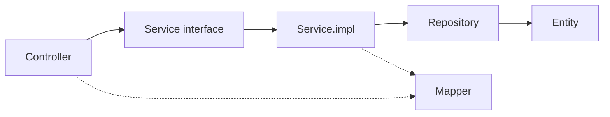

# Development Rules

## HelpDesk Management System — Engineering Handbook

| | |
|---|---|
| **Document Version** | 1.0 |
| **Status** | Accepted — Implementation Standard |
| **Applies to** | All code committed to `backend/` and `frontend/` from this point forward |
| **Does not repeat** | Business scope ([01-SRS.md](01-SRS.md)), system/module architecture ([02-Architecture.md](02-Architecture.md)), or security design ([07-Security-Architecture.md](07-Security-Architecture.md) through [10-Security-Assurance.md](10-Security-Assurance.md)) — this document governs *how code is written*, not *what the system does* or *why it's shaped the way it is* |
| **Tech stack this document targets** | Java 21 · Spring Boot 3 · Spring MVC · Spring Security · Spring Data JPA · Hibernate · MySQL · Maven · Thymeleaf · Tailwind CSS · JavaScript. Planned additions: Flyway, MapStruct, Docker, JUnit 5, Mockito. |
| **Open item — flagged, not resolved here** | This stack (MySQL, server-rendered Thymeleaf) differs from the persistence and frontend technology chosen in [02-Architecture.md](02-Architecture.md) / ADR-0002 (PostgreSQL, a decoupled React SPA). This document is written against the stack given for this phase. Before implementation starts in earnest, that discrepancy needs an explicit reconciling decision (a superseding ADR) — it is called out here so it isn't silently designed around twice. |

This is the internal engineering handbook for this codebase. It is binding, not advisory: code that violates a rule here should not pass review. Where a rule and a reviewer's personal preference disagree, the rule wins — raise a change to this document instead of a one-off exception in a PR.

---

## Table of Contents

1. Coding Philosophy
2. Java Coding Standards
3. Package Structure
4. Layer Responsibilities
5. DTO Rules
6. Entity Rules
7. Repository Rules
8. Service Layer Rules
9. Controller Rules
10. Validation Rules
11. Exception Handling
12. Security Rules
13. Logging Rules
14. Database Rules
15. API Design Rules
16. Testing Rules
17. Git Workflow
18. Code Review Checklist
19. Performance Guidelines
20. Future Engineering Standards

---

## 1. Coding Philosophy

**Clean code is a maintenance-cost decision, not an aesthetic one.** Every line of code is read far more often than it is written — by the next engineer, by the reviewer, by the author themselves six months later. Code that is clear on first read is cheaper to change, cheaper to debug, and cheaper to onboard a new engineer against than code that is merely "clever" or terse. On a project explicitly scoped for years of continuous feature addition ([02-Architecture.md](02-Architecture.md)), this compounding cost is the dominant cost — not the few seconds saved writing a shorter but denser line today.

**Consistency beats local optimization.** A codebase where every module solves the same kind of problem (pagination, validation, error handling) the same way is faster to work in than one where each module reflects its author's individual taste, even if some of those individual choices were locally "better." When a rule in this document and a genuinely better local idea conflict, propose changing the rule — don't quietly deviate. An inconsistent codebase is slower for everyone, including the person who introduced the improvement.

**Simplicity is preferred over cleverness.** If a reviewer has to pause and mentally trace what a line of code does, that line has a cost regardless of how efficient or elegant it is. Favor the boring, obvious implementation. A stream pipeline that replaces three lines of clear imperative code with one dense line is not an improvement unless it also improves clarity — performance is not usually the bottleneck at this system's scale ([02-Architecture.md §18](02-Architecture.md#18-performance-considerations)), but comprehension always is.

**Methods do one thing.** A method name is a promise; a method that does more than its name says is a method that lies to its next reader. If a method needs an internal comment to explain "and then it also does X," that comment is a signal to extract `X` into its own, well-named method instead.

**Duplication is a liability, not a convenience.** Copy-pasted logic drifts — one copy gets a bug fix, the other doesn't. The rule is not "never write two similar-looking blocks of code" (some duplication is cheaper than a bad abstraction); it is "never let the same *business rule* exist in two places." Three lines of structurally similar mapping code, each about a different entity, is fine. The same ticket-status-transition check implemented twice is not — it belongs in exactly one place ([02-Architecture.md §16](02-Architecture.md#16-design-patterns-used), the `TicketWorkflowValidator`).

**Code should be self-documenting.** Well-chosen names for classes, methods, and variables should make the *what* obvious without a comment. Comments are for the *why* that the code cannot express on its own:

| Comment is appropriate for | Comment is not appropriate for |
|---|---|
| A non-obvious business constraint ("reopen is capped at 7 days per FR-TICK-7, not configurable per-org in this phase") | Restating what the next line does ("// increment counter") |
| A workaround for a specific external bug/limitation, with a reference | A summary of a well-named method's body |
| Why an approach that looks wrong at a glance is actually deliberate (e.g., a deliberately duplicated audit write inside the same transaction, ADR-0006) | Commented-out code — delete it; version control remembers it |
| A `TODO` with an owner and a tracked reference, never a bare `TODO` | Narrating the obvious structure of the class (getters/setters, standard CRUD) |

No class, method, or package needs a comment explaining what this system is or why it exists — that context lives in [01-SRS.md](01-SRS.md) and [02-Architecture.md](02-Architecture.md), never duplicated into source comments.

---

## 2. Java Coding Standards

### 2.1 Naming Conventions

| Element | Convention | Example |
|---|---|---|
| Package | all lowercase, no underscores, singular nouns | `com.helpdesk.ticket`, not `com.helpdesk.Tickets` |
| Class | `PascalCase`, noun/noun-phrase | `TicketService`, `NotificationEventListener` |
| Interface | `PascalCase`, no `I`-prefix (`IService` is banned) | `TicketService`, not `ITicketService` |
| Interface implementation | interface name + `Impl` suffix, placed in `service.impl` | `TicketServiceImpl` |
| Abstract class | `PascalCase`, prefixed `Abstract` only when the abstraction itself is the point (a template-method base) | `AbstractScheduledJob` |
| Enum | `PascalCase` type name; `UPPER_SNAKE_CASE` constants | `enum TicketStatus { OPEN, IN_PROGRESS, ... }` |
| Record | `PascalCase`, named for the data it carries, not its mechanism | `TicketSummary`, not `TicketSummaryRecord` |
| Constant (`static final`) | `UPPER_SNAKE_CASE`, declared in the `constant` package unless truly private to one class | `MAX_ATTACHMENT_SIZE_BYTES` |
| Method | `camelCase`, verb or verb-phrase; boolean-returning methods read as a question | `assignTicket(...)`, `isEligibleForReopen()` |
| Variable / field | `camelCase`, meaningful noun — never a single letter outside a `for` loop index | `assignedEngineer`, not `ae` |
| Type parameter | single uppercase letter or short `PascalCase` for a meaningful generic role | `T`, `ID`, or `RequestType` where a bare `T` would be ambiguous |
| Test method | see Section 16.4 | `shouldRejectTransition_whenTicketNotAssigned()` |

**Abbreviations are banned** except a closed, reviewed allow-list of industry-standard terms: `id`, `dto`, `url`, `http`, `sql`, `jwt`, `api`. `usr`, `tkt`, `mgr`, `cfg` and similar are not permitted — the two extra characters of `user`/`ticket`/`manager`/`config` cost nothing and remove ambiguity.

### 2.2 Formatting

- **Indentation:** 4 spaces, never tabs.
- **Braces:** K&R / "Egyptian" style — opening brace on the same line, no exceptions, including single-statement `if` blocks (braces are always present; a brace-less `if` is a defect waiting to happen the day a second statement is added).
- **Line length:** 120 characters max. A line that legitimately needs more is a signal to extract a variable or a method, not to disable the line-length check.
- **Imports:** one import per line, no wildcard imports (`import java.util.*;` is banned — it defeats the purpose of imports as a dependency inventory and risks silent symbol collisions). Static imports are permitted only for test assertions (`assertEquals`, `assertThat`) and Mockito verbs (`when`, `verify`) — never for production business code, where a qualified call (`Collections.emptyList()`) keeps the call site's origin visible.
- **Import order:** `java.*` / `javax.*` → third-party (`org.springframework.*`, etc.) → project (`com.helpdesk.*`), each group blank-line-separated, alphabetical within a group. Enforced by the IDE formatter/CI check, not manual discipline.
- **Blank lines:** one blank line between methods; no blank line immediately after an opening brace or before a closing brace.

### 2.3 `final` Keyword

- Every constructor-injected field is `private final` — no exceptions (Section 8.3).
- Method parameters and local variables are `final` where doing so meaningfully signals "this value is never reassigned within this scope" for a non-trivial method body; not mechanically applied to every trivial one-line method, where it adds noise without adding clarity.
- Classes not designed for extension are declared `final` by default (favor composition over inheritance, Section 2.4) unless the class is deliberately part of an extension point (e.g., an `AbstractScheduledJob` base, Section 2.1).

### 2.4 General Java Practices

- Favor composition over inheritance; inheritance is reserved for genuine is-a relationships with a stable contract (JPA entity base classes for shared audit fields, Section 6.6, are the one sanctioned use in this codebase).
- Prefer `Optional<T>` as a **return type** for a value that may legitimately be absent — never as a field type, a constructor/method parameter type, or a collection element type.
- Prefer immutable data (records, `final` fields, unmodifiable collections returned from accessors) wherever the object represents a fact rather than evolving state.
- Use the enhanced `switch` expression over legacy `switch` statements and long `if`/`else if` chains once there are three or more branches on the same discriminant.
- Never catch `Exception` or `Throwable` broadly in business code — catch the specific exception type the call site can actually throw; broad catches belong only in the Global Exception Handler (Section 11).
- Null is not a valid "not found" or "not applicable" signal for a method return — return `Optional<T>`, throw a domain exception (Section 11), or return an empty collection, chosen deliberately per case, never a bare `null` a caller has to remember to check.

---

## 3. Package Structure

Package-by-module, then by-layer within each module (rationale and full module list already established in [02-Architecture.md §5](02-Architecture.md#5-package-structure) and ADR-0011 — not repeated here). This section fixes the concrete, per-module layer skeleton every module must follow, using the layer-package names for this implementation phase:

```
com.helpdesk.<module>
├── controller/        @Controller (Thymeleaf views) and/or @RestController (JSON API) endpoints
├── service/            Service interfaces — the module's public contract
├── service.impl/       Service implementations — business logic lives here, nowhere else
├── repository/         Spring Data JPA repository interfaces
├── entity/             JPA-mapped domain objects
├── dto/                 Request/response DTOs (Section 5)
├── mapper/             DTO ⇄ Entity mapping (Section 5.5)
├── validation/         Module-specific custom validators
├── specification/      Spring Data JPA Specification<T> predicates for this module's search/filter (FR-FILT-1-style queries)
└── audit/               Module-specific audit-event definitions, where distinct from the shared audit infrastructure
```

Shared, cross-module packages remain top-level (unchanged from [02-Architecture.md §5](02-Architecture.md#5-package-structure)):

```
com.helpdesk
├── config/         @Configuration classes, @ConfigurationProperties
├── security/        Spring Security configuration, JWT/session handling, method-security support beans
├── exception/       Custom exception hierarchy, GlobalExceptionHandler (Section 11)
├── constant/         Shared enums/constants with no natural home in one module
├── util/             Stateless, pure helper classes only — never a dumping ground for business logic
└── audit/            Shared audit infrastructure (the append-only recorder contracts, ADR-0006)
```

**Rules:**
- A class belongs in exactly one package, chosen by what it *is*, not by convenience. A `TicketSpecification` belongs in `ticket.specification`, never in `util` because it was quicker to drop it there.
- `util` is reviewed with suspicion: if a "utility" method contains a business rule (anything that would change if the SRS changed), it belongs in a Service, not `util`.
- A module's `service.impl` package is never imported directly by another module — cross-module calls always go through the target module's `service` interface (ADR-0001). This is checked in review and is a strong CI-check candidate (an ArchUnit rule) once the test suite exists (Section 16).

---

## 4. Layer Responsibilities



Dependencies point strictly left-to-right / top-to-bottom in this diagram. A layer never calls back into a layer to its right, and no layer is skipped (a Controller never calls a Repository directly, even for something that "looks simple").

| Layer | Responsible for | Must never |
|---|---|---|
| **Controller** | Binding the request (path/query/body) to a validated DTO; delegating to exactly one Service call; mapping the Service result to a response DTO or view model; choosing the HTTP status / view name. | Contain an `if` expressing a business rule; call a Repository; open or manage a transaction; construct an entity. |
| **Service (interface)** | Declaring the module's public contract — method signatures expressed in DTOs/domain types only. | Reference an entity type or a Repository type in its signature. |
| **Service.impl** | Business rules, orchestration across repositories, transaction boundaries (`@Transactional`), authorization checks that depend on data (Section 12), publishing domain events. | Reference `HttpServletRequest`/`HttpServletResponse`, a `Model`, or any Spring MVC/web type; return an entity from a public method. |
| **Repository** | Persistence only — Spring Data derived queries, `@Query`, `Specification` composition. | Contain a business rule (a "should this transition be allowed" check belongs in Service, never encoded as a query predicate that happens to produce the right rows). |
| **Entity** | Mapping to a table; enforcing invariants that are always true regardless of caller. | Be returned from, or accepted by, a Controller method (Section 6.1); contain logic that depends on another entity's current state (that's a Service-layer concern). |
| **DTO** | Defining one endpoint's wire/view contract in one direction. | Be reused as, or converted implicitly into, an entity; carry persistence annotations. |
| **Mapper** | Structural DTO ⇄ Entity conversion only. | Contain a conditional business rule — a mapper that branches on business state is a Service wearing a mapper's name. |
| **Config** | Wiring beans, binding `@ConfigurationProperties`. | Contain conditional business logic. |
| **Util** | Small, pure, stateless, deterministic helpers. | Hold state; contain a business rule; depend on a Spring bean. |

"No business logic inside controllers" and "no database logic inside controllers" are the two most-violated rules in typical Spring MVC codebases (usually via a `Model`-populating branch that quietly encodes a business decision) — reviewers should read every controller method looking specifically for a conditional that isn't purely about response shape.

---

## 5. DTO Rules

### 5.1 When to Use a DTO
Every Controller boundary — request in, response out — uses a DTO. There is no endpoint that accepts or returns an entity, ever (Section 6.1). Thymeleaf view models follow the same discipline: a template is populated from a purpose-built view DTO, not a raw entity passed into the `Model`.

### 5.2 Request vs. Response DTOs
Named and modeled separately even when their field sets overlap — a request DTO expresses *what a client is allowed to send*, a response DTO expresses *what a client is allowed to see*. Collapsing them into one shared class is a common source of mass-assignment-shaped bugs (a field that should be read-only becomes writable because the DTO doubles as both directions).

| DTO kind | Naming | Example |
|---|---|---|
| Request | `<Action><Resource>Request` | `CreateTicketRequest`, `UpdateProfileRequest` |
| Response | `<Resource>Response` or `<Resource>Summary` for a list-view projection | `TicketResponse`, `TicketSummary` |

### 5.3 Never Expose Entities
No entity class is ever a Controller method's parameter or return type, and no entity is ever passed into a Thymeleaf `Model`. This is non-negotiable: it is both an API/view-contract-stability concern and a security control (an entity's field set is not curated for what's safe to expose, a DTO's is — see [07-Security-Architecture.md §1](07-Security-Architecture.md#1-security-goals), Mass Assignment, threat #18).

### 5.4 Validation Annotations
Bean Validation annotations (`@NotBlank`, `@Size`, `@Email`, `@Pattern`, custom constraints) live on **request DTO fields only** — never on entity fields (an entity's own invariants, if any, are enforced in its constructor/factory method, not via Bean Validation, which is a request-boundary concern; see Section 6.1). Every request DTO consumed by a Controller method is annotated `@Valid` at the parameter (Section 10).

### 5.5 Mapping
DTO ⇄ Entity mapping lives in the module's `mapper` package. **Current state (pre-MapStruct):** mappers are plain Java classes with explicit, hand-written static or instance methods (`TicketMapper.toResponse(Ticket ticket)`), never reflection-based generic mapping — every field that crosses the boundary is a visible, reviewable line of code, so an entity field is invisible in a DTO until someone deliberately adds a mapping line for it (secure-by-default). **Future state:** once MapStruct is adopted (Section 20), `@Mapper`-annotated interfaces replace the hand-written implementations with generated equivalents — call sites (`ticketMapper.toResponse(ticket)`) do not change, because the migration replaces an implementation, not the mapper's public method signature. Do not write mapping logic inline in a Service or Controller under any circumstance, even "just this once."

### 5.6 Immutability
DTOs are Java `records` wherever the framework allows it (all response DTOs; request DTOs unless a specific Jackson/Bean-Validation interaction requires a mutable class, which should be treated as the exception, not the default). A DTO represents a fact captured at one point in time — it is never mutated after construction.

### 5.7 Versioning Strategy (Future)
Not required at the current single-client (Thymeleaf-rendered) stage. Once a standalone JSON API surface is versioned (`/api/v1/...`, per the API design rules in Section 15), a DTO that changes shape in a breaking way is not edited in place — a new DTO class is introduced for the new version, and the old one is retained until that API version's deprecation window closes. This rule is recorded now so it is not improvised under deadline pressure later.

---

## 6. Entity Rules

### 6.1 General
Entities model persistence, not the API or view surface (Section 5.3). An entity is JPA-annotated, package-private-by-default where the module boundary allows it (an entity referenced only within its own module's `service.impl`/`repository`/`mapper` does not need to be `public` beyond that), and never implements `Serializable` for any reason other than a JPA provider's specific requirement (never "for the API," which is precisely the boundary DTOs exist to own).

### 6.2 Annotations
- `@Entity` + `@Table(name = "...")` — table name always explicit, never left to Hibernate's implicit naming strategy, so the physical name is a reviewed decision, not an accident of the current naming-strategy configuration (Section 14.1).
- `@Id` + `@GeneratedValue(strategy = GenerationType.IDENTITY)` for MySQL (`AUTO_INCREMENT`-backed) — chosen over `SEQUENCE`/`TABLE` strategies specifically because MySQL's native auto-increment is the idiomatic, best-supported option for this database engine.
- `@Column(name = "...", nullable = ..., length = ...)` always explicit — never relying on a field's Java type/name alone to imply the column's nullability or size.

### 6.3 Relationships & Lazy Loading
- Every `@ManyToOne`/`@OneToMany`/`@ManyToMany` is `fetch = FetchType.LAZY`, with no exceptions — `EAGER` is banned outright, including on `@ManyToOne` (where Hibernate's own default is `EAGER` — this must always be explicitly overridden). Eager fetching, where genuinely needed for a specific query, is expressed at the query level (`JOIN FETCH`, `@EntityGraph`), never as the entity's default (consistent with [02-Architecture.md §18](02-Architecture.md#18-performance-considerations)).
- `@ManyToMany` is avoided where a join table would need its own attributes (timestamps, an actor) now or foreseeably — model it as an explicit join entity instead (`@OneToMany` on both sides of the join entity) rather than retrofitting it later.
- Bidirectional associations always designate one side `mappedBy` (the non-owning side) — never two independently-owning sides of the same relationship.

### 6.4 Cascade Types
`CascadeType.ALL` is banned. Cascades are declared individually and deliberately (`{CascadeType.PERSIST, CascadeType.MERGE}`, for example) based on the actual lifecycle relationship — a child that must never outlive deletion of its logical owner is the only case that considers `CascadeType.REMOVE`, and even then only where the domain model doesn't rely on soft delete instead (Section 6.7; per this system's design, most parent/child relationships use soft delete precisely so cascading hard deletes are rarely the right tool).

### 6.5 `equals()` / `hashCode()`
Based on the entity's identifier (`id`) only, never on a mutable business field, and only once the entity has been persisted (a transient entity, `id == null`, is never equal to another transient entity of the same type, including itself compared before and after persistence — implemented via the standard "compare by id, treat null-id as unequal to everything but itself by reference" pattern). Never generated via a blanket IDE "all fields" `equals`/`hashCode` — that pattern breaks the moment a lazy association is touched inside a collection's hash computation.

### 6.6 `toString()`
Includes the identifier and a small number of stable, non-sensitive, non-lazy fields only. Never includes a password hash, a token, or any field named in the "never log" list (Section 13.3) — `toString()` output ends up in logs whether or not a developer intended it to (Section 13), so this is a security rule as much as a debugging-convenience one. Never includes a lazy association (triggers an unintended fetch, and risks a `LazyInitializationException` outside a transaction).

### 6.7 Audit Fields & Soft Delete
Every mutable entity carries `createdAt`/`updatedAt`, populated via Spring Data JPA Auditing (`@CreatedDate`/`@LastModifiedDate` on a shared `@MappedSuperclass`, e.g. `AuditableEntity`) — never set manually in service code. Entities using soft delete (per [02-Architecture.md ADR-0005] — currently `Ticket` and `Category`'s active flag) expose their delete state as `deletedAt`/`active` and rely on the repository-level default filter (Section 7.4), never an ad hoc `WHERE` clause repeated per query method.

### 6.8 Naming
Entity class name is singular (`Ticket`, not `Tickets`); table name is plural, `snake_case` (`tickets`); column names are `snake_case`, matching the field's intent, not its Java type (`assigned_engineer_id`, not `assigned_engineer_fk`).

---

## 7. Repository Rules

### 7.1 Spring Data JPA Usage
Prefer derived query methods (`findByStatusAndPriority(...)`) for simple, single-condition-shaped queries. Once a query's condition count or optionality (some filters present, some not — FR-FILT-1-style combinable filters) makes a derived method name unreadable, switch to a `Specification<T>` (Section 7.3) rather than continuing to grow the method name.

### 7.2 Custom Queries
`@Query` with **named parameters** (`:status`, never positional `?1`) is used when a derived method name would be misleading or when a join/projection needs explicit control. JPQL is the default; native SQL requires the justification in Section 7.6.

### 7.3 Specifications
Every module with combinable, optional search/filter parameters (Tickets being the primary case, FR-FILT-1) builds its queries from composable `Specification<T>` predicates in that module's `specification` package — one small, independently testable method per filter condition (`hasStatus(status)`, `hasPriority(priority)`, `createdBetween(from, to)`), composed with `Specification.allOf(...)`/`.and(...)` in the Service layer, never as one large hand-assembled `Specification` inline in a Repository or Controller.

### 7.4 Default Filtering (Soft Delete)
Repositories for soft-deletable entities apply the "exclude soft-deleted" predicate as the default for every standard query method (via a base `Specification` always AND-ed in, or Hibernate's `@SQLRestriction`) — a query method never needs to remember to add `AND deleted_at IS NULL` itself. An explicit, separately named method (`findByIdIncludingDeleted`) exists for the one legitimate audit-view exception, and is restricted to Administrator-facing call paths only.

### 7.5 Pagination & Sorting
Every list-returning repository method used by a list-facing endpoint accepts a `Pageable` and returns `Page<T>` — a `List<T>`-returning, unpaginated query method is not added for anything that could grow unbounded (FR-PAGE-1). Sort fields are validated against an allow-list in the Service layer before being passed down (Section 10) — a raw client-supplied sort string is never passed directly into `Sort.by(...)`.

### 7.6 Native Queries
Permitted only when: (a) the query requires a MySQL-specific feature JPQL cannot express (e.g., a full-text `MATCH ... AGAINST` search), or (b) a demonstrated, profiled performance problem with the JPQL/Criteria equivalent exists. Every native query is still parameterized (named parameters, never string concatenation — Section 12.1) and carries a one-line comment stating which of (a)/(b) justifies it.

### 7.7 Transactions
Repositories never declare `@Transactional` themselves — a repository call is not necessarily the full unit of work. Transaction boundaries are owned by the Service layer (Section 8.4).

---

## 8. Service Layer Rules

### 8.1 Business Logic Only
All business rules — workflow legality, ownership checks, cross-entity orchestration — live here and nowhere else (Section 4). A Service method's job is to be the one place a business rule can be found, tested, and changed.

### 8.2 Validation
Business validation (uniqueness, state-transition legality, cross-field rules that need current data) is explicit in the Service — a visible `if (...)` throwing a named exception (Section 11.2), never delegated silently to a database constraint's failure as the only signal.

### 8.3 Constructor Injection Only
Every dependency is injected via the constructor, assigned to a `private final` field. Field injection (`@Autowired` on a field) and setter injection are both banned — constructor injection makes every dependency visible at construction, makes the class trivially unit-testable without a Spring context (Section 16.1), and makes a circular-dependency mistake fail fast at startup instead of silently at runtime.

### 8.4 Transactions
`@Transactional` is declared at the Service.impl method level, at the smallest scope that still represents one full unit of work (e.g., a status change plus its audit-log write, ADR-0006, commit or roll back together). Read-only query methods are annotated `@Transactional(readOnly = true)`. A transaction is never left open across a call into another module's Service unless that call is itself meant to join the same unit of work — cross-module orchestration that spans multiple independent units of work is a signal the boundary is drawn wrong, not a case for a longer transaction.

### 8.5 No Repository Exposure
A Service's public interface never returns a `Repository` type, a `Specification<T>`, or a JPA-specific type to its caller — callers (Controllers, other modules) depend only on DTOs and domain-level results.

### 8.6 Method Length & Private Helpers
A public Service method that reads as more than roughly 5–7 sequential steps is a signal to extract a private helper method with a name that describes *what* the extracted step accomplishes (not `step2` or `helper`). Extraction is about readability, not about mechanically shrinking line counts — a shorter method that requires jumping between three private helpers to understand one linear flow is not an improvement.

---

## 9. Controller Rules

### 9.1 Two Controller Shapes
This codebase has two distinct controller shapes, kept structurally separate — never mixed in the same class:

- **`@Controller`** — Thymeleaf view controllers. Return a view name (or a `String` redirect); populate a view-model DTO into the `Model`; handle form-post request bodies bound to a request DTO.
- **`@RestController`** — JSON API controllers (`/api/...`, Section 15). Return response DTOs (or `ResponseEntity<T>` where the status code itself is conditional); never return a view name.

### 9.2 REST Conventions (for `@RestController` endpoints)
Resource-oriented, plural nouns, HTTP-method-conveys-intent — full convention in Section 15. A Controller method's name states the action in business terms (`assignTicket`, not `patchTicket2`).

### 9.3 HTTP Status Codes
Chosen deliberately per outcome, not defaulted to `200` for everything: `201` for creation (with a `Location` header where applicable), `204` for a successful action with no body, `400`/`404`/`409`/`403`/`401` mapped from the exception hierarchy by the Global Exception Handler (Section 11), never chosen ad hoc per controller method.

### 9.4 Request Validation
Every request DTO parameter is annotated `@Valid`. A Controller method never re-validates by hand what Bean Validation already expresses declaratively (Section 10).

### 9.5 Consistent Responses
Every `@RestController` response follows the shared envelope/error-contract conventions fixed in Section 15 and [04-API-Design.md](04-API-Design.md) — no endpoint invents its own response shape.

### 9.6 Pagination Endpoints
A list endpoint accepts `page`/`size`/`sort` query parameters (bound via `Pageable`, with a capped max `size`, Section 7.5) and returns the standard paged-response envelope (Section 15.6) — never a bare, unbounded array.

### 9.7 Error Responses
A Controller never constructs an error response itself (no local `try/catch` building a custom error body) — every error propagates to the Global Exception Handler (Section 11). This is what keeps the error contract actually consistent across every endpoint.

### 9.8 API Documentation
Every `@RestController` endpoint carries OpenAPI/Swagger annotations (`@Operation`, `@ApiResponse`) describing purpose, expected status codes, and auth requirements — documentation is generated from the code, not maintained separately, so it cannot silently drift out of sync (consistent with [02-Architecture.md](02-Architecture.md)'s choice of springdoc-openapi).

---

## 10. Validation Rules

### 10.1 Layering
Four layers, each with one job — full rationale in [02-Architecture.md §14](02-Architecture.md#14-validation-strategy); the coding-level rule is that each layer's check is written **once**, at its own layer, never duplicated at another:

1. **Bean Validation** on request DTOs (`@NotBlank`, `@Size`, `@Email`, `@Pattern`) — structural correctness, rejected before any business code runs.
2. **Custom validators** (`@Constraint`-annotated, in `validation`) for a structural rule too specific for a built-in annotation (e.g., `@StrongPassword`).
3. **Business validation** in the Service layer — anything that requires reading current data (uniqueness, workflow legality, ownership).
4. **Database constraints** — the last-resort guarantee, never the first check performed, and never the source of a client-facing message (Section 11.4).

### 10.2 Meaningful Validation Messages
Every validation annotation carries an explicit `message` referencing a message-catalog key, never the framework's default generic text (`"must not be blank"` alone doesn't tell a user *which* rule they violated in context) — see the error-response format in Section 11.4.

### 10.3 Never Trust Client Input
Every value crossing the Controller boundary is untrusted until validated — including values a well-behaved client "would never send" (a `page` size, a sort field name, a foreign key that looks plausible). Server-side validation is never skipped because "the frontend already checks this" — client-side (JavaScript/Thymeleaf form) validation is a UX convenience only, never a security or correctness boundary.

### 10.4 Input Sanitization
Handled at the point of use, not as a blanket input-scrubbing filter (Section 9.5 of [08-Security-Controls.md](08-Security-Controls.md#95-sanitization)) — free-text fields are length-capped via Bean Validation, filenames are normalized for display only (never used structurally, Section 12.5), and output encoding (Thymeleaf's default escaping, never `th:utext` on user-supplied content) is the actual XSS defense, not input stripping.

---

## 11. Exception Handling

### 11.1 Global Exception Handler
A single `@ControllerAdvice` class is the only place an exception is translated into an HTTP response or an error view — no Controller method contains a `try`/`catch` that builds its own error response (Section 9.7). It handles both `@RestController` (JSON `ErrorResponse`) and `@Controller` (a rendered error view/flash message) call paths, each mapped from the same underlying exception hierarchy.

### 11.2 Custom Exception Hierarchy
One abstract base (`HelpDeskException`), carrying a stable `errorCode` and an HTTP-status hint, with named subtypes per category — full hierarchy already fixed in [02-Architecture.md §12](02-Architecture.md#12-exception-flow--strategy) (`BusinessException`, `ValidationException`, `ResourceNotFoundException`, `AuthenticationException`, `AccessDeniedException`, `ConflictException`). A new business-rule failure gets a new, specifically-named exception (`TicketNotAssignedException`, not a generic `BusinessException("ticket not assigned")` string) — the type itself should be self-documenting, and lets the handler and any calling test branch on type, not on message text.

### 11.3 Business vs. Validation Exceptions
Business exceptions are thrown explicitly from Service methods, always with the specific subtype that matches the failure. Validation exceptions are, in the common case, raised by the framework itself (`MethodArgumentNotValidException` from `@Valid`) and handled generically — a Service method never manually re-raises what Bean Validation would already have caught upstream.

### 11.4 Error Response Format
Fixed, not improvised per endpoint — the `{errorCode, message, violations?, timestamp, traceId}` contract from [02-Architecture.md §12](02-Architecture.md#12-exception-flow--strategy) and [09-Security-Operations.md §18](09-Security-Operations.md#18-error-handling). `message` is always drawn from a reviewed catalog, never built from `exception.getMessage()` (SDR-009) — this is the single most common way a stack trace or SQL fragment accidentally leaks to a client, and it is banned as a pattern, not just discouraged.

### 11.5 Logging Strategy
The Global Exception Handler logs full detail (stack trace for unexpected exceptions, business context for expected ones) server-side at the appropriate level (Section 13.2) before returning the sanitized client response — the client-facing `traceId` is what lets an engineer find that log entry without the response needing to carry the detail itself.

---

## 12. Security Rules

The full security design lives in the SecAD ([07-Security-Architecture.md](07-Security-Architecture.md) through [10-Security-Assurance.md](10-Security-Assurance.md)) — this section is the coding-level checklist that operationalizes it, not a restatement of the threat model or the RBAC design.

- **Never trust client data** — every request value is validated and re-authorized server-side regardless of what the UI already constrains (Section 10.3; Zero Trust goal, [07-Security-Architecture.md §1](07-Security-Architecture.md#1-security-goals)).
- **RBAC enforcement** — every Service method touching role- or ownership-scoped data carries an explicit `@PreAuthorize`, placed on the Service **interface**, never assumed to be covered by a Controller-level check alone (Section 4.4 of [07-Security-Architecture.md](07-Security-Architecture.md#44-method-level-authorization-strategy)). Role/permission string literals are never hand-typed at a call site — reference the shared `constant` values.
- **Password encoding** — always via the injected `PasswordEncoder` bean (BCrypt, SDR-001); a raw password is never compared with `.equals()`, ever, anywhere, including in a test fixture.
- **JWT / session handling** — token issuance, verification, and cookie flags are configured in exactly one place (`security` package); a Controller or Service never reads a raw `Authorization` header or cookie value directly — it depends on the already-populated `SecurityContext`/principal.
- **CSRF** — every state-changing Thymeleaf form includes the CSRF token (Spring Security's Thymeleaf integration adds it automatically to `th:action` forms — never disable this per-form); JSON API mutating calls follow the double-submit pattern (SDR-007) where cookie-based auth is in play.
- **Authentication rules** — no endpoint is public by omission; every new route is explicitly classified public or authenticated at the moment it's added (Secure by Default, [07-Security-Architecture.md §1](07-Security-Architecture.md#1-security-goals)).
- **Authorization rules** — a resource the caller isn't authorized to see returns "not found," not "forbidden" (Section 18.2 of [09-Security-Operations.md](09-Security-Operations.md#182-error-response-structure)) — this is a coding-level rule enforced consistently, not a case-by-case judgment call per endpoint.
- **Secure headers** — never overridden or disabled per-controller; the shared header baseline (SDR-014) applies uniformly and is configured once, centrally.
- **Secrets management** — no credential, key, or token is ever a literal in source code, a log statement, or a comment — `${ENV_VAR}` placeholders only (Section 17 of [09-Security-Operations.md](09-Security-Operations.md#17-configuration-security)).

---

## 13. Logging Rules

### 13.1 SLF4J
Every class that logs declares its own `private static final Logger log = LoggerFactory.getLogger(ThisClass.class);` — never a shared/static logger across classes, and never a direct dependency on a specific logging backend (Logback) from application code.

### 13.2 Log Levels

| Level | Use for |
|---|---|
| `ERROR` | An unexpected failure requiring engineering attention — always with the exception and full context. |
| `WARN` | An expected-but-notable failure (validation rejection, authorization denial, optimistic-lock conflict) — not an engineering emergency, but worth surfacing. |
| `INFO` | A significant business event (ticket created, user logged in) — sparse enough that INFO logs remain useful, not a play-by-play of every method call. |
| `DEBUG` | Detail useful for local troubleshooting only — never enabled in `prod` (Section 17.6 of [09-Security-Operations.md](09-Security-Operations.md#176-profiles)). |

### 13.3 Never Log
Passwords (plaintext or hashed), raw JWTs/refresh tokens/CSRF tokens, database/mail credentials, and full sensitive-PII payloads — at any level, including `DEBUG` (Section 16.2 of [09-Security-Operations.md](09-Security-Operations.md#162-what-is-never-logged-at-any-level)). This is enforced by never including these fields in an entity/DTO's `toString()` (Section 6.6) in the first place, not by remembering to omit them at each individual `log.info(...)` call site.

### 13.4 Correlation IDs
Every log line within a request is tagged with that request's `traceId` (populated into SLF4J's MDC by a shared interceptor, [02-Architecture.md §13](02-Architecture.md#13-logging-flow--strategy)) — never manually threaded through method parameters.

### 13.5 Audit Logging
A business-significant state change (ticket status/assignment/priority, user role change) is recorded through the audit recorder contracts (`audit` package, ADR-0006/SDR-012), never approximated by an `INFO`-level application log alone — application logs are for operational troubleshooting; the audit log is the reviewable, queryable record of *who did what*.

### 13.6 Examples

```
// Good — structured, no sensitive data, actionable
log.warn("Ticket status transition rejected: ticketId={}, from={}, to={}, actor={}",
        ticketId, currentStatus, requestedStatus, actorId);

// Good — business event, sparse
log.info("Ticket created: ticketId={}, ticketNumber={}, createdBy={}", ticket.getId(), ticket.getTicketNumber(), userId);

// Bad — logs a credential
log.debug("Login attempt: email={}, password={}", email, password);

// Bad — string concatenation instead of parameterized logging (defeats lazy evaluation, harder to grep)
log.info("Ticket " + ticketId + " was updated by " + actorId);

// Bad — vague, not actionable, no identifiers to correlate
log.error("Something went wrong");
```

---

## 14. Database Rules

### 14.1 Naming Conventions
`snake_case` throughout — table names plural (`tickets`, `ticket_activities`), column names descriptive and type-agnostic (`assigned_engineer_id`, not `assigned_engineer_fk` or `assignedEngineerId`). Every table and column name is explicit in the entity's mapping annotations (Section 6.2) — never left to a naming-strategy default, so a rename of a Java field never silently renames a column.

### 14.2 Indexes
Every column used in a `WHERE`, `JOIN`, or `ORDER BY` for a list/search/filter/sort/report code path is indexed — the specific index list for this system's query patterns is fixed in [05-Database.md §6](05-Database.md#6-indexing-strategy) (written against PostgreSQL there; MySQL equivalents — standard `BTREE` indexes, MySQL full-text indexes in place of PostgreSQL's `GIN`/`tsvector` — need re-deriving once the MySQL-vs-PostgreSQL discrepancy flagged at the top of this document is resolved). New list/filter/sort endpoints are not merged without an explicit "does this query path touch an unindexed column" review question (also Section 18).

### 14.3 Foreign Keys
Every relationship in the entity model is backed by a real, database-enforced foreign key — never an "application-enforced only" association. `ON DELETE` behavior is chosen deliberately per relationship (`RESTRICT` vs. `CASCADE`), following the pattern already justified in [05-Database.md §5](05-Database.md#5-cascade-rules): `RESTRICT` on anything the application never hard-deletes, `CASCADE` only on purely dependent, no-independent-audit-value data.

### 14.4 Unique Constraints
Declared at the database level for every uniqueness rule the application relies on (`email`, `ticket_number`, `category.name`) — a Service-layer "check first, then insert" is a UX-friendliness check (a nicer error message before hitting the DB), never the sole enforcement, since a race between two concurrent requests can only be closed by the database constraint itself.

### 14.5 Flyway Migration Strategy (Target State)
Flyway is on the near-term roadmap (Section 20), not yet wired in — but schema changes are written and reviewed **as if it already were**: every schema change is expressed as a small, sequential, reviewed SQL script (`V{n}__{description}.sql` naming, once Flyway is added) rather than relied upon to "just happen" via Hibernate. This means: no engineer relies on Hibernate's schema auto-generation for anything beyond a disposable local sandbox (Section 14.6), and every schema change is captured in a form that will drop directly into `db/migration/` the day Flyway is introduced, with no retroactive reconstruction needed.

### 14.6 No Automatic Schema Changes in Production
`spring.jpa.hibernate.ddl-auto` is **never** `update` or `create`/`create-drop` outside a throwaway local `dev` sandbox, and is `validate` (or `none`, once Flyway owns schema state) in every shared environment (`test`, `prod`) without exception. An automatically-applied schema change in a shared environment is treated as a production incident, not a convenience — this is a hard line, not a judgment call per deploy.

---

## 15. API Design Rules

Applies to the `@RestController`/JSON surface (Section 9.1); Thymeleaf view routes follow standard MVC path conventions instead and are not subject to the REST-specific rules below (versioning, resource-plural naming).

### 15.1 REST Naming
Resource-oriented, plural nouns, no verbs in the path (`GET /tickets/{id}`, not `GET /getTicket`) — action-shaped operations that don't fit clean CRUD use a sub-resource or a clearly-named action path (`POST /tickets/{id}/close`), matching the endpoint inventory already fixed in [04-API-Design.md](04-API-Design.md).

### 15.2 Versioning Strategy
URI-based, `/api/v1/...` (ADR-0012) — a breaking change to one resource's contract ships as `/api/v2/<that-resource>` only, never a wholesale version bump of the entire API surface.

### 15.3 Consistent Response Format
Every successful response returns the resource's response DTO directly (or the paged envelope, 15.6); every error response returns the shared `ErrorResponse` contract (Section 11.4). No endpoint invents a bespoke wrapper.

### 15.4 Filtering & Sorting
Expressed as query parameters, each validated against an explicit allow-list of filterable/sortable fields per resource (Section 10.3) — combinable per FR-FILT-1, translated into `Specification` predicates (Section 7.3) in the Service layer, never string-interpolated into a query.

### 15.5 Pagination
Mandatory on every list endpoint (Section 9.6, FR-PAGE-1) — `page` (0-based), `size` (default 20, server-enforced max 100 regardless of what a client requests), `sort`.

### 15.6 Paged Response Envelope
```
{
  "content": [...],
  "page": 0,
  "size": 20,
  "totalElements": 137,
  "totalPages": 7
}
```

### 15.7 HTTP Methods
`GET` (safe, no side effects), `POST` (create, or a named non-idempotent action), `PUT`/`PATCH` (update — `PUT` for a full-resource replace, `PATCH` for a partial/targeted update such as a status transition), `DELETE` (soft-delete trigger, Section 14.3/[05-Database.md](05-Database.md)) — chosen per the semantics actually intended, never `POST` used as a catch-all for every mutation.

### 15.8 Idempotency
`GET`/`PUT`/`DELETE` are idempotent by construction — a repeated identical call produces the same end state. State-transition endpoints (`POST /tickets/{id}/close`) are made idempotent deliberately where the business semantics allow it (closing an already-closed ticket again is a no-op success, not an error) and explicitly rejected as a conflict where they must not be silently repeatable (Section 11.2's `ConflictException`, backed by optimistic locking, ADR-0010).

---

## 16. Testing Rules

JUnit 5 and Mockito are on the near-term roadmap (Section 20) — the standard below is the target every test written from this point forward must follow, so the suite is consistent from its first test rather than converging toward consistency later. Full strategy/pyramid rationale is in [06-Testing.md](06-Testing.md); this section is the coding-level convention.

### 16.1 Unit Tests
Target Service.impl classes, mappers, validators. Dependencies are mocked via Mockito, constructed via plain `new ClassUnderTest(mockDep1, mockDep2, ...)` — no Spring context. This is only possible because of constructor injection (Section 8.3); a class requiring field-injection workarounds to test in isolation is a design defect, not a testing inconvenience.

### 16.2 Integration Tests
Target repository query correctness and constraint behavior, run against a real MySQL instance via Testcontainers — never against an in-memory substitute (H2), since in-memory engines do not faithfully reproduce MySQL-specific behavior (collation, `AUTO_INCREMENT` semantics, engine-specific constraint enforcement). Suffixed `*IT`, run in a separate build phase from `*Test` unit tests (Section 16.5).

### 16.3 Controller Tests
`@WebMvcTest` per controller, Service layer mocked, verifying HTTP status, response/view shape, and that the expected authorization annotation is actually wired (a route missing `@PreAuthorize` should fail its controller test, not just "happen to work" because no one tried the unauthorized case).

### 16.4 Test Naming
`should<ExpectedBehavior>_when<Condition>()` — a test name states its assertion and its trigger without needing to read the body (`shouldRejectTransition_whenTicketNotAssigned()`, `shouldReturn404_whenTicketNotVisibleToCaller()`). A test class is named `<ClassUnderTest>Test` (or `*IT` for integration tests, Section 16.2).

### 16.5 Mockito Conventions
`when(...).thenReturn(...)` for stubbing, `verify(...)` for behavior assertions — never both mixed to assert the same fact (don't stub a return value and then separately verify the same call was made just to double-check; pick the one that actually expresses what the test cares about). No `@Mock`-annotated field is left unused in a test class — an unused mock is either dead test code or a sign the test doesn't need that collaborator at all.

### 16.6 Coverage Expectations
No blanket percentage target (a hollow number is not the goal, [06-Testing.md §9](06-Testing.md#9-coverage-expectations)). Instead: every business rule (a ticket workflow transition, an RBAC ownership check) has an explicit positive and negative test; every new Service method ships with its unit test in the same PR that introduces it — a PR adding business logic with no accompanying test does not pass review (Section 18).

---

## 17. Git Workflow

### 17.1 Branch Strategy

| Branch | Purpose |
|---|---|
| `main` | Always deployable. Direct commits are never made to `main`. |
| `develop` | Integration branch for the next release; feature branches merge here first. |
| `feature/<short-description>` | New functionality, branched from `develop`. |
| `fix/<short-description>` | Bug fixes, branched from `develop` (or from `main` for an urgent hotfix, merged back to both). |
| `docs/<short-description>` | Documentation-only changes. |

Branch names are lowercase, hyphen-separated, and specific (`feature/ticket-reopen-window`, not `feature/updates`).

### 17.2 Commit Message Convention
[Conventional Commits](https://www.conventionalcommits.org/): `<type>(<scope>): <summary>`, imperative mood, no trailing period.

| Type | Use for |
|---|---|
| `feat` | A new capability |
| `fix` | A bug fix |
| `refactor` | A behavior-preserving code change |
| `test` | Adding or correcting tests only |
| `docs` | Documentation only |
| `chore` | Build/tooling/dependency changes |
| `perf` | A performance improvement with no behavior change |

Example: `feat(ticket): enforce assignment requirement before resolve transition`

### 17.3 Pull Request Checklist
Every PR description states: what changed and why (linked to the relevant SRS/module reference where applicable), how it was tested, and whether it touches security-sensitive surface (auth, RBAC, file handling — flagged explicitly so it gets extra review attention). A PR that only says "see commits" is not sufficient.

### 17.4 Merge Strategy
Squash-merge into `develop`/`main` — one PR becomes one commit on the target branch, keeping history readable; the individual in-progress commits on the feature branch are free-form during development (no obligation to keep every WIP commit Conventional-Commits-clean), but the final squashed commit message always is.

---

## 18. Code Review Checklist

Every reviewer works through this list before approving — not as a formality, but as the actual gate this document exists to enforce:

- **Readable?** Would a new engineer understand this code's intent without needing the author to explain it?
- **Consistent?** Does it follow the naming, layering, and package rules in this document, or does it introduce a one-off pattern?
- **Secure?** Does it touch auth/RBAC/file-handling/input-handling — and if so, does it follow Section 12 and the SecAD without exception?
- **Tested?** Does new business logic ship with unit tests (Section 16.6)? Do the tests actually assert the behavior, not just exercise the code path?
- **Validated?** Is every new request DTO field covered by an appropriate Bean Validation or business-validation rule (Section 10)?
- **Logged?** Are the significant events in this change observable in logs/audit trail without being over-logged or leaking anything on the never-log list (Section 13)?
- **Documented?** Are OpenAPI annotations present on new `@RestController` endpoints (Section 9.8)? Does a non-obvious decision carry the *why* comment it needs (Section 1)?
- **Performance considered?** Any new query path checked against Section 19 (N+1, missing pagination, missing index)?

A PR that fails any of these is not approved with a "fix in a follow-up" comment for anything in Sections 12 (Security) or 14.6 (schema changes) — those two categories are blocking, always.

---

## 19. Performance Guidelines

- **Avoid N+1 queries.** Every list-view query path is checked for lazy-association access inside a loop; fetch what's needed via `JOIN FETCH`/`@EntityGraph`/a projection DTO at the query level (Section 6.3, [02-Architecture.md §18](02-Architecture.md#18-performance-considerations)) — never by flipping an entity's default fetch type to `EAGER` to make one call site's symptom go away.
- **Pagination is mandatory**, not a performance nice-to-have added later (Section 15.5).
- **Lazy loading is the default**, eager fetching is a deliberate, query-level exception (Section 6.3).
- **Caching (future):** no caching layer exists yet; when introduced (`@Cacheable` over rarely-changing reference data — categories, roles), cache invalidation is designed alongside the cache itself, in the same change, never bolted on after a staleness bug is reported.
- **Query optimization** is driven by a demonstrated cost (a slow-query log entry, a profiled endpoint), not by guesswork — an index or a query rewrite added "because it seems like it'd be faster" without a measured basis is reviewed with the same skepticism as any other unverified claim.
- **Avoid premature optimization.** Clarity is the default; a less-readable-but-faster implementation is justified only against a real, measured problem — not against a hypothetical one. This is not license to ignore Section 19's structural rules (pagination, N+1, indexing) — those are default-correct design, not "optimization."

---

## 20. Future Engineering Standards

These are not implemented yet but are named here so their eventual introduction follows a pre-agreed shape rather than an ad hoc one:

| Capability | Adoption trigger / shape |
|---|---|
| **Flyway** | Introduced before the first shared (non-solo-local) environment needs a schema change — migrations follow the versioned-script discipline already assumed by Section 14.5. |
| **MapStruct** | Replaces the hand-written mappers in `mapper` packages (Section 5.5) once introduced — a mechanical, non-breaking swap of implementation for existing call sites. |
| **Docker** | Containerizes the existing Spring Boot JAR with no application code change (per [02-Architecture.md §21](02-Architecture.md#21-future-architecture-roadmap)) — a `Dockerfile` and, if needed, `docker-compose.yml` for local MySQL, added once a shared/deployed environment exists. |
| **JUnit 5 / Mockito** | Section 16's conventions apply from the first test written — there is no "transition period" of inconsistent test style to migrate away from later. |
| **CI/CD (GitHub Actions)** | Runs build, unit tests, (once added) integration tests, and static analysis (below) on every PR — merge is blocked on a red pipeline, not advisory. |
| **SonarQube** | Static analysis gate for code smells, duplication, and complexity — thresholds agreed and documented at adoption time, not silently tightened after the fact. |
| **SpotBugs** | Bug-pattern static analysis, run in CI alongside SonarQube — findings triaged (fixed or explicitly suppressed with a reason), never silently ignored. |
| **OWASP Dependency-Check** | CVE-scanning gate on the dependency tree (already named as a requirement in [09-Security-Operations.md §16](09-Security-Operations.md#16-dependency--configuration-hardening)/SecAD Section 19.4) — a build fails on a newly-disclosed critical CVE in a direct dependency, not merely warns. |
| **Monitoring / Metrics (Prometheus, Grafana)** | Spring Boot Actuator's metrics endpoint is the foundation already available once Actuator is added — Prometheus scraping and Grafana dashboards are additive against it, per the observability roadmap item in [02-Architecture.md §21](02-Architecture.md#21-future-architecture-roadmap). |

Each of these is additive against the rules already fixed in Sections 1–19 — adopting one is never an excuse to relax an existing rule (e.g., introducing SonarQube does not change what Section 18's review checklist already requires by hand today; it automates part of the check).
